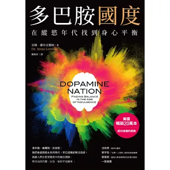
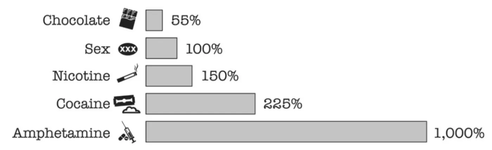
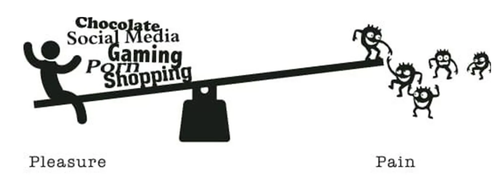
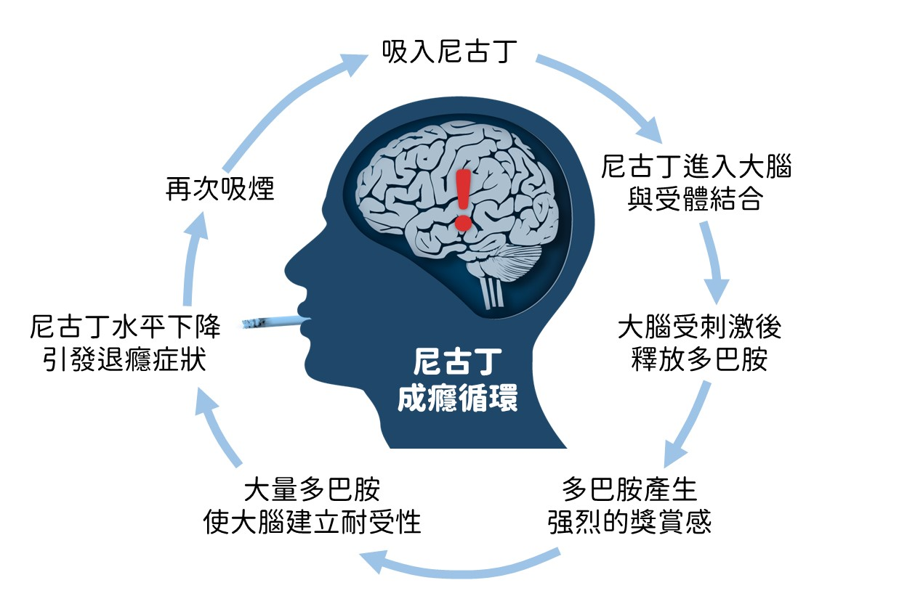

《多巴胺國度》討論人在娛樂與刺激隨手可得的環境中，如何理解「癮」，以及如何重新取得身心平衡。

## 我想從這本書理解什麼？

- 如何面對甚至戒除已經影響生活的「癮」？
- 多巴胺在追求獎勵的過程中扮演什麼角色？
- 過度追求快感會帶來哪些代價？
- 能否反過來利用這套機制，讓生活過得更穩定？

## 快感與痛苦的平衡

### 多巴胺是什麼？

多巴胺是人腦中重要的神經傳導物質之一。它不只是讓人感到愉悅，更重要的是驅動我們去追求可能得到的獎勵。分泌通常發生在期待與取得獎勵的過程，而不只是在享受之後。

書中用蹺蹺板比喻快感與痛苦：當其中一端受到強烈刺激，身體會試著往另一端補償，以維持平衡。

### 上癮的負面循環

當一個行為不再是為了實際需求，而只是為了再次獲得刺激，便可能形成「為了爽而爽」的循環。例如看完內容後感到空虛，於是立刻尋找下一段內容；遊戲抽卡失利後刪除遊戲，卻又因不甘心重新開始。

停止刺激後不一定立刻恢復。書中提到，戒斷期間可能暫時失去感受愉悅的能力；需要經過一段時間，身體才會逐漸回到較穩定的狀態。

## 為什麼現代人更容易上癮？

- 娛樂、藥物、短影音和遊戲都比以前更容易取得。
- 生存需求占用的時間變少，能用來追求刺激的空間增加。
- 產品被設計成持續提供新的獎勵與期待。

書中用「生活在綠洲裡的仙人掌」形容這種處境：我們的身體仍為匱乏環境而設計，生活卻已被過量刺激包圍。

## 自縛：替自己增加界線

作者提出 DOPAMINE 架構，先理解自己的行為，再有意識地暫停與觀察：

- **Data**：記錄自己的實際行為。
- **Objectives**：釐清這項行為帶來的目的。
- **Problems**：辨認它已經造成的問題。
- **Abstinence**：暫時停止刺激。
- **Mindfulness**：觀察戒斷過程中的念頭與感受。
- **Insight**：整理從過程中得到的理解。
- **Next steps**：決定接下來如何行動。
- **Experiment**：把調整視為可驗證的實驗。

也可以從空間、時間與意義替自己設限，例如讓刺激變得較難取得、限定使用時段，或重新定義這項行為在生活中的位置。

## 主動選擇痛苦

除了減少快感刺激，書中也討論主動承受適量不適，例如運動、飢餓或冷水。概念不是懲罰自己，而是先壓下蹺蹺板的痛苦端，讓身體在回復平衡時產生正向感受。

對我而言，最重要的提醒是：先誠實看見自己的行為與缺點，才有可能重新選擇，而不是一直被下一次刺激牽著走。
