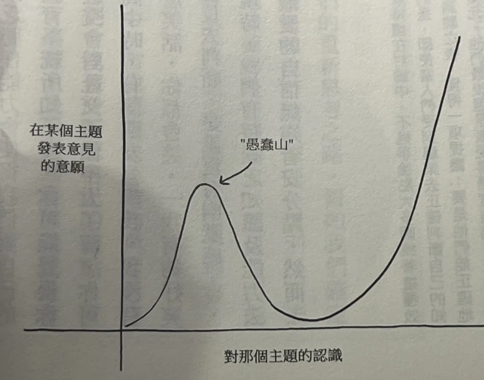
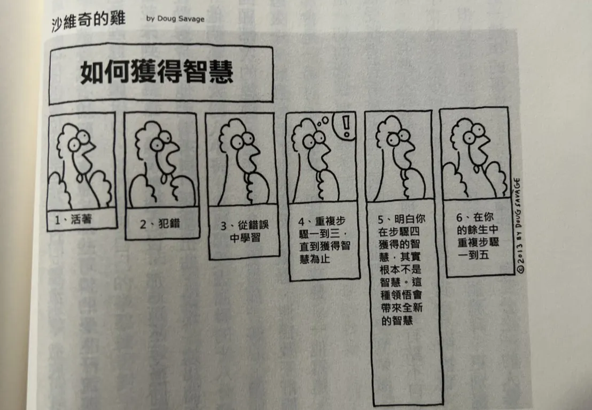

「溫水煮青蛙」經常被用來比喻人無法察覺逐漸逼近的危險，但這個故事本身並不正確。青蛙在水溫變得難受時會試著離開。真正缺少質疑與重新思考能力的，可能是重複這則故事的我們。

《逆思維》的核心提醒很簡單：不要只重新思考別人的主張，也要反覆檢查自己的信念、方法與身份認同。

## 四種思考心態

Adam Grant 將常見的思考方式比喻為四種角色：

- **傳教士**：當信念受到威脅時，努力宣揚自己的理念。
- **檢察官**：專注找出他人論點的瑕疵，證明對方錯誤。
- **政治人物**：試著爭取支持與認同。
- **科學家**：把觀點視為假設，願意根據證據修正。

科學家心態不是永遠懷疑一切，而是保留「我可能是錯的」這個空間。

## 個人的重新思考

信心太低會讓人不敢行動，過度自信則讓人停止學習。書中描述一種「愚蠢山」：只獲得少量知識時，信心快速上升；繼續深入後，才開始理解問題真正的複雜度。

重新思考可以發生在幾個層次：

- 重新檢查某個觀點，而不是只收集支持它的證據。
- 不把職業或單一選擇當成永久的自我定位。
- 收到評論時，先理解對方提供了什麼資訊。
- 與人爭論時，把任務衝突和人際衝突分開。

犯錯並不可怕；反覆犯同一種錯，卻不更新方法，才會停止成長。

## 人際關係中的重新思考

說服他人時，追問「如何」通常比追問「為什麼」更有用。「如何」會迫使雙方把抽象立場展開成實際機制，也更容易發現自己尚未想清楚的地方。

刻板印象也會影響我們如何解讀他人的話。重新思考並不是立刻放棄原本立場，而是先將對方視為一個可能提供新資訊的人。

## 團體與社會中的重新思考

- **讓爭議變得更複雜**：許多問題不是只有正反兩面；補上條件與細微差異，能降低立場對立。
- **擴張情緒範圍**：在對話中保留好奇，而不只剩下憤怒或防衛。
- **用行動引導學習**：教育孩子時，與其只填入答案，不如鼓勵他們提出問題與採取行動。
- **建立心理安全感**：讓團隊成員可以指出問題、承認錯誤並挑戰現狀，而不用擔心因此受罰。
- **停止迷信最佳實務**：一旦某個方法被稱為「最佳」，人們反而容易停止尋找更好的做法。

## 對人生重新思考

我們容易把已經走過的路變成唯一能走的路。重新思考不是否定過去，而是偶爾重新問自己：我仍然想要這個目標嗎？如果今天重新選擇，我還會用同一種方式前進嗎？
