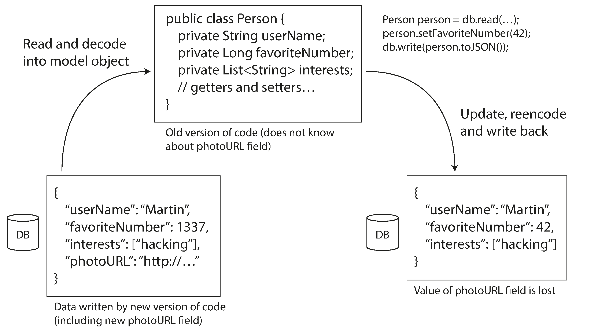
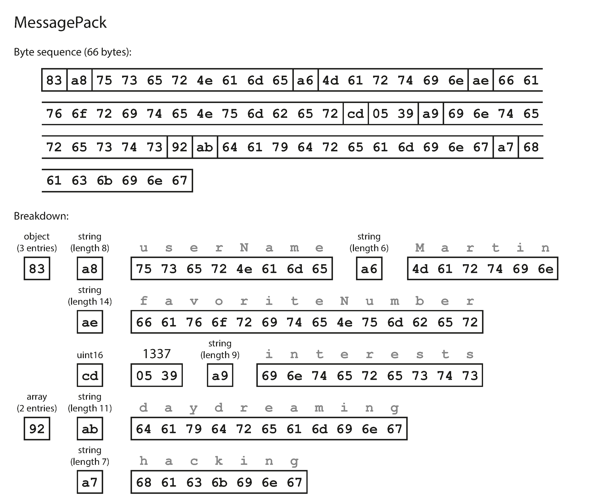
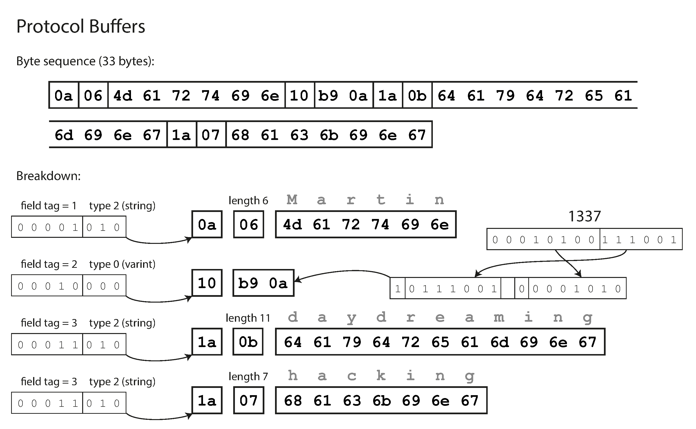
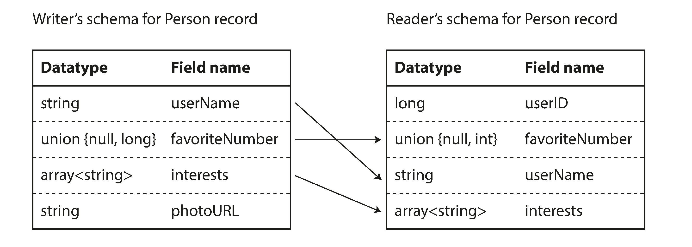

編碼與演化

## 演化？

make change easy，產品 or application 是會隨著時間演化的，就有可能改到寫入 or 讀取的格式…

要注意的是？

- 向後兼容 backward compatibility
    - newer code can read data that was written by older code
- 向前兼容 forward compatibility
    - Older code can read data that was written by newer code.

例子:

備份的格式是 old code 產生的, 新的 code 要怎麼讀舊的備份檔 就是一種 backward compatibility

若備份的檔案是 new code 產生的, 舊的 code 要怎麼讀新的備份檔 則是 forward compatibility



## Decode / Encode

including JSON, XML, Protocol Buffers, and Avro

Restful / RPC

## Encoding is in every

- local read (write): 對 mem 操作，不需要做太多的轉換，存取頻繁
    - e.g., unordered_map<int, int> / vector<int> / …
- remote read (send)
    - 透過網絡時，explicit 的值就比較沒有意義，傳送一次接收一次而已
    - 通常會編碼 → 解碼
    - 提升速度 / 比較安全

### Encoding:

- 程式語言內部的 encoding:
    - python: Java 有 `java.io.Serializable`，Python 有 `pickle`，Ruby 有 `Marshal`
    - 問題：不能跨語言, 安全問題改 byte 之類的, 效率, 跨版本
- 跨語言的 如: JSON, XML, and Binary Variants

## **JSON, XML, and Binary Variants**

### JSON

in everywhere, OpenAPI Web 服務協議的一部分 / PostgreSQL, MongoDB 專門驗證 json 的驗證器 `$jsonSchema`

json 的更進階用法: `additionalProperties` 接收端的設定

`minimum` / `maximum`  , `patternProperties` , `if` / `else`

### Binary encoding

JSON 傳送時所需空間已經比 XML 還小, 但還是要浪費大量空間

而 binary encoding 又更小了

JSON 編碼:

```json
{
    "userName": "Martin",
    "favoriteNumber": 1337,
    "interests": ["daydreaming", "hacking"]
}
```

81 bytes

### MessagePack (JSON 的 binary 編碼)

66 bytes: 減少了空格

少了一點空間卻, 降低了可讀性.  是否值得?



---

## Protocol Buffers (protobuf)

google 開發的 binary encoding, 主要用於 RPC

RPC: remote procedure call, (主打的就是把某個 api 接口當作是 function 來 call, 常在 microservice 中看到)

```protobuf
syntax = "proto3";

message Person {
    string user_name = 1;
    int64 favorite_number = 2;
    repeated string interests = 3;
}
```



僅需要 33 bytes

最大的區別為不需要 keys

透過最一開始定義的 field tag + type 來進行識別

## Evolution?

當今天 new code 有新的 field 要寫入怎麼辦？

由於 new code 跟 old code 都是是按照 field tag 來區分資料，所以我們不能改變既有的 field tag

而是要加入 new field tag with optional property

- Backward compatibility: new code 完全可以讀 old code 寫入的資料, 因為 optional 的設計, 所以可以讀
- Forward compatibility: 也沒問題 old code 可以讀 new code data 因為 field tag 一樣

**Questions**?

畢竟為了未來著想的開發本來就很難 (設計 protobug), new code 可能根本用不到 old code 的資料, 但卻還要 maintain 非常痛苦, 怎麼辦？

Moreover `Avro`:

- dynamic register of the schema, 不需要維護舊的 field key
- 一種更激進的 binary encoding 手段, 可以有更小的 encoding byte 也包含 evolution 能力 , provided by apache



### Conclusion:

JSON vs Protobuf

json 更靈活, 甚至有更多更複雜的設定 e.g., range

Protobuf:

- more compact than the "json / json binary" by omit the field names form the encoding data
- schema 的重要性, 由於不同的 code 勢必會 maintain 一份 schema 用來讀寫資料, 可以保證一致 (相對的 need mantain this schema manually)
- is really usaful in statically typed programming language, (type checking at compile time)

## Modes of Dataflow

- Via database
- Via service call
- Via workflow
- Via async message passing

### Via Database

用於存儲東西

問題:

- 需處理不同時間寫入的不同值

### Via service call (REST & RPC)

通常有兩種角色, client & server

問題:

- local function 是可以明確預測結果的 e.g., (成功 / 失敗)，
web request 則有更多變因 e.g., 封包丟失 / remote server crash / return type error / timeout /
- 當 request 發生 timeout, 無從得知發生了什麼問題, 我需要再 retry 嗎，還是放棄處理
- 時間問題: local function 比 service call 快太多了
- server 相關技術: load balance …

### Via workflow

- 編排: Airflow
- 持久化執行: Temporal

### Via async message passing

- Apache Kafka, 傳送到 queue 中，之後再慢慢處理，處理完後寫入 result quest，等待領取
