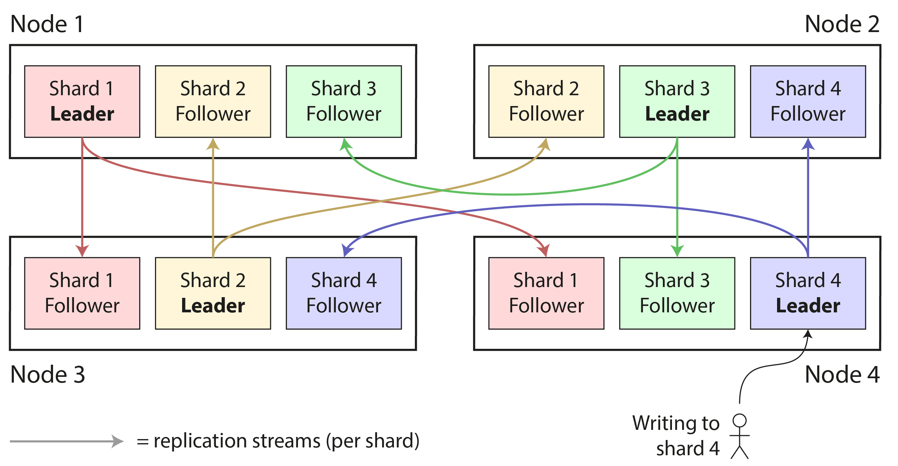
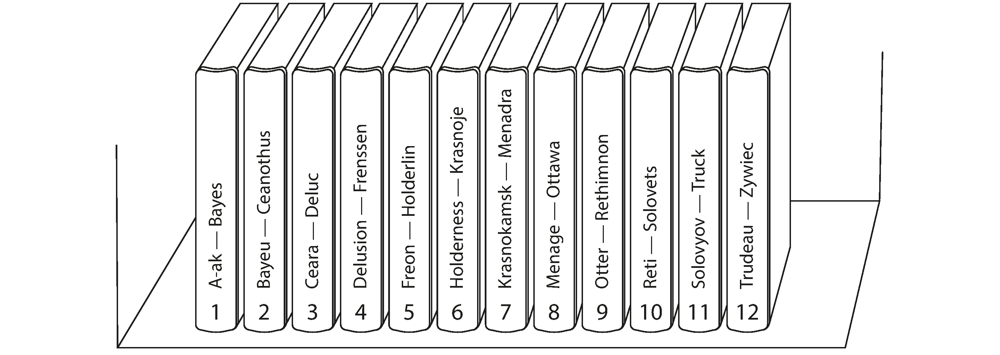
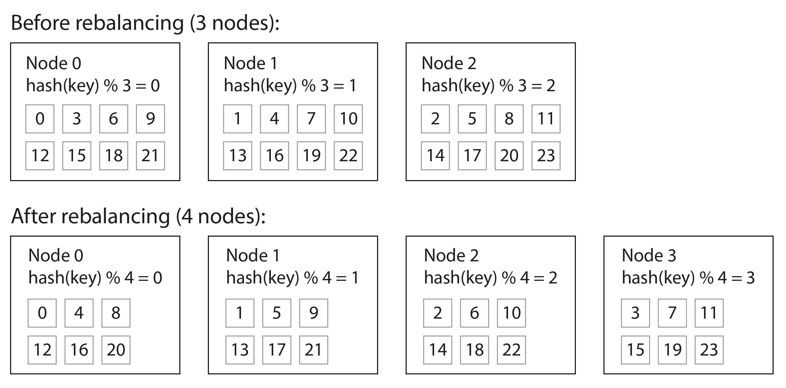
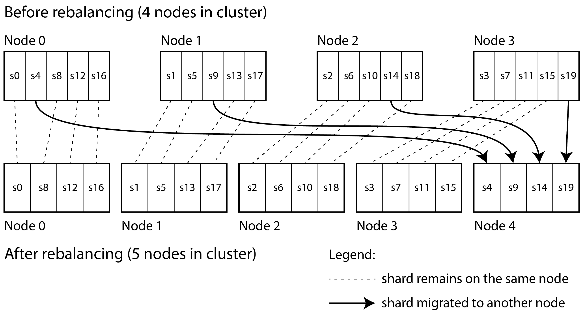
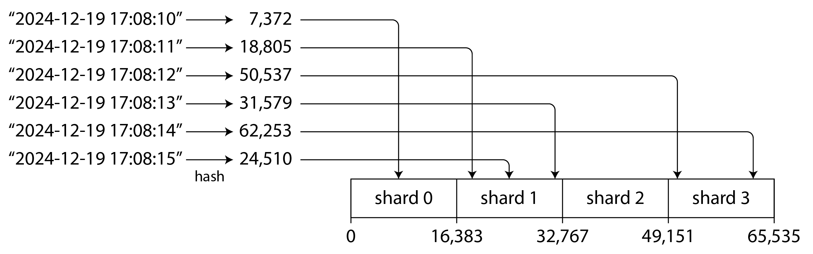
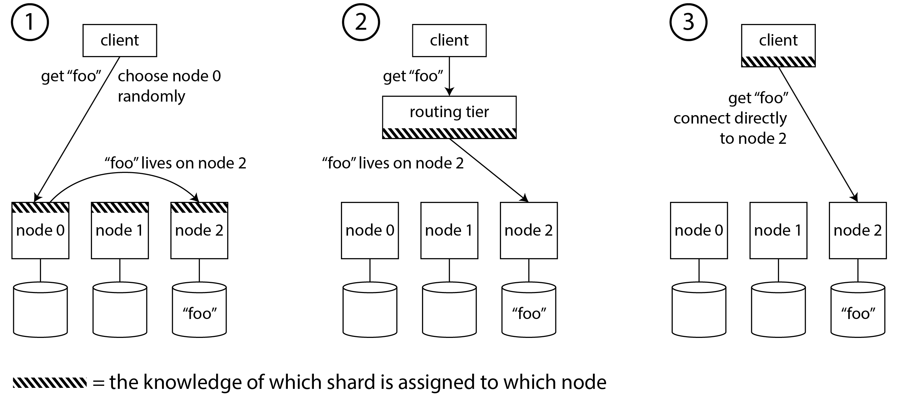
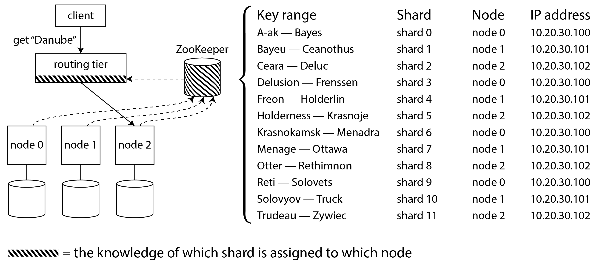
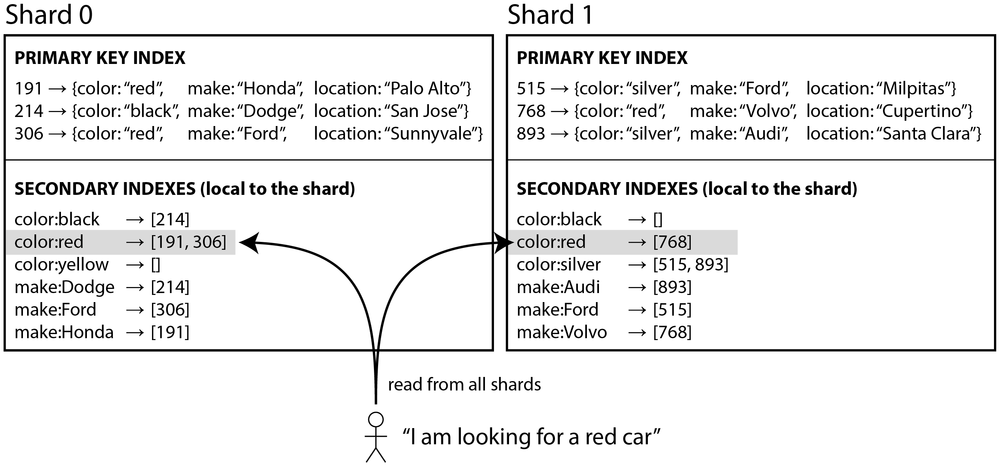
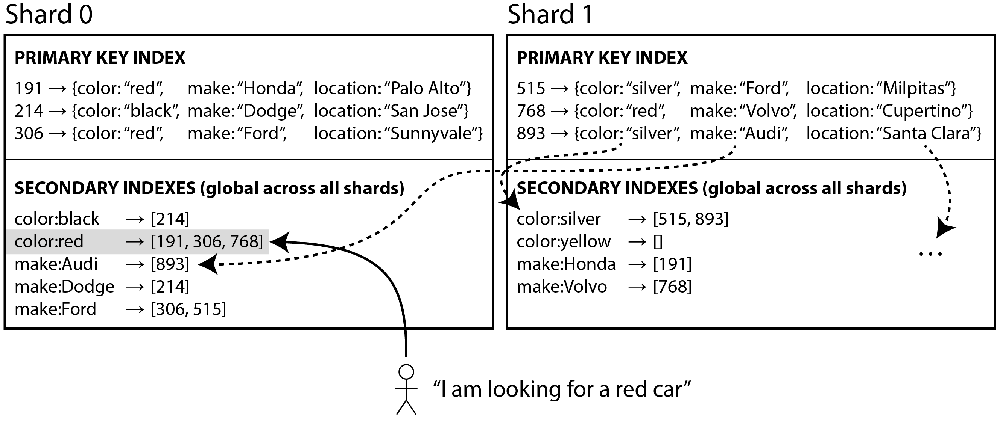

in ch5: discussed replication: multiple copies of the same data on different nodes.

Replication 不足夠解決: 超大的 dataset or 超大量的 query

Partition 就是將原本該全部塞在某個 db 中, 分割成存在多個 node 上

Each partition is a small database of its own, can support like touch multiple partitions at the same time

Take away

- 什麼時候該考慮 partition
- approaches for 分割與索引 large datasets
- reblancing
- databases route requests to partions and execute query

### partition & replcation

## 什麼時候考慮 partition

- 單一個 node 的 資料量 or query throughput 已經無法負荷時可以考慮, partition 可以將 read write 分散到不同 node 上
    - query throughput 用水平擴展也就可以有效解決
- 大規模情境下才有意義 (by book)
    - 如果真的到單一 node 無法負荷才做 partition
- 完全的資源隔離 e.g., aws 出租 db 也很適合
- Partition 會使得 db 變更複雜, e.g., 要存到哪, 要從哪讀
- 難點: 批次處理 transaction 比較困難

## Partioning of Key-Value Data

- 如果我們亂分類資料？ 每次搜尋 n 個 partition 就要 n 次 query
- skew / hot spot issue: query 都在某些 partition 上, 效果變得很差

### Partition by key Range

- 可以發現 partition key 不必是均分的, 因為資料分佈不一定均分 (manually / auto)
- Always keep keys in sorted order (like SSTable)
    - 方便查詢
    - 方便 range query
- 要用什麼當key?
    - 越自然分布的東東越適合
    - 時間戳可能不太適合

### Patition by Hash of key

- hash > mod n (?)

直覺 以 node 數量當作是 hash key / mod n

今天 mod n 變成 n+1

問題：搬移 (rebalancing) 會很麻煩

**Solution:**

### 固定數量的 partition

一開始就有較高的 fixed size hashing key e.g., 20 個 partition (20 key)

要新增 node 就搬整個 partition 就好

*Citus（PostgreSQL 的分片层）、Riak、Elasticsearch 和 Couchbase*

問題：很難在一開始就估 partition 要多少個

### partition by hash of key

- 就有 Random 效果了
- 16bit hashing, 即使 timestamp 接近, 但散落各處
- range query 效能不佳

## Skewed Workloads and Hot Spots

就算 hash 讓資料分散的很好, 還是有可能碰巧 or 事件發生導致某個 partition 很熱

幾種方法：

- key 後面加上 random number 後再 hash

Amozon: 有處裡 hot partition 的方法…

*manually rebalance*

## Request Routing

1. random pick
2. pick by router
3. directly connect to correct node (partition)

## Partitioning and Secondary Indexs

### 什麼是二級索引？

- **定義**：除「主鍵/一級索引」以外的任何索引，都屬於二級索引。通常建立在經常出現在 `WHERE / JOIN / ORDER BY / GROUP BY` 的欄位上，用來加速查詢。
- **數量**：一個表只能有一個主鍵索引，但可以有多個二級索引。
- **唯一性**：二級索引可以是唯一（UNIQUE）也可以非唯一，視你的設計而定。

### Secondary indexes by document (local)

由於每個 Partition 都是獨立的, 每個 partition 需要 maintain 自己的 secondary indexs

可能導致 query 變的更慢

### Secondary indexes by term (global)

- Secondary indexes 也被 partitioin

但好處是你可以一次就拿到所有的 id (只有id)

寫入變的複雜… 第八章
