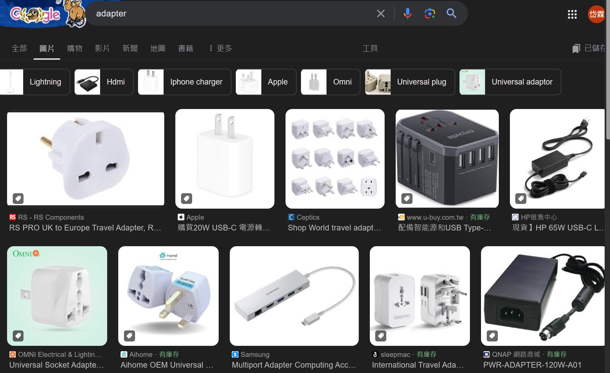

Adapter 接的東西是什麼?

- 插座 (台灣) <---- adapter (轉接器) ----> 電器 (中國)
    - 不會為了中國電器 在牆上做一個插頭
    - 也不會為了 台灣插座，改中國的電器

- 筆電 <---- adapter (外接器) ----> 網絡線
    - 不會為了網路線在筆電上挖網絡孔
    - 也不會去變更網絡線的連線方式去適配筆電現有的接口

point: 插頭 / 電腦

## Scenario

It's very often used in systems based on some legacy code. In such cases, Adapters make legacy code work with modern classes.

- legacy systems (mysql)
- magic interface (input: json format)

## Case Study

```cpp
class MacBook {
public:
    virtual HDMI::DataType HDMIPort() const {
        return "HDMI signal";
    }
};

class Monitor {
public:
    void VGAPortDisplay(VGA::DataType data) const {
        std::cout << "Displaying on Monitor: " << data << std::endl;
    }
};

class Adapter : public MacBook {
private:
    Monitor *monitor_;

public:
    Adapter(Monitor *monitor) : monitor_(monitor) {}

    VGA::DataType HDMI2VGA(HDMI::DataType data) const {
        return "Converted to VGA: " + data;
    }

    HDMI::DataType HDMIPort() const override {
        VGA::DataType vgaData = HDMI2VGA("HDMI signal from MacBook");
        monitor_->VGAPortDisplay(vgaData);
        return "HDMI signal handled by VGA monitor";
    }
};
```
