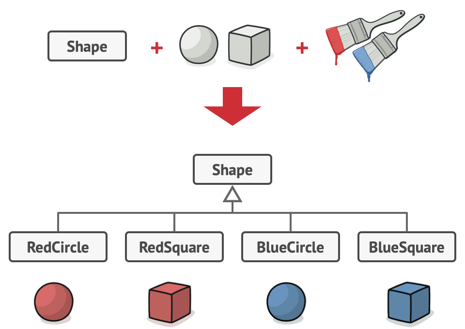
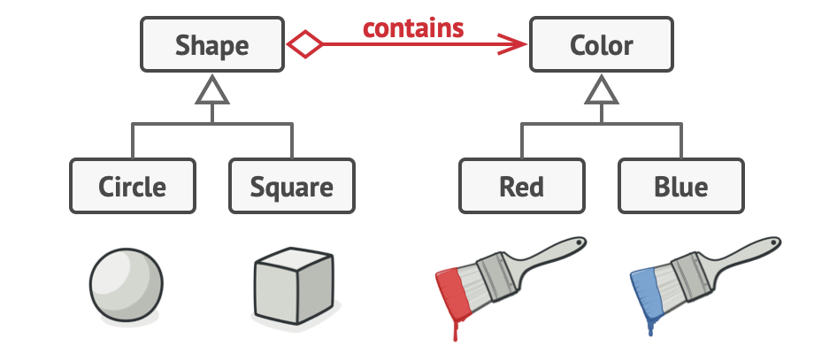
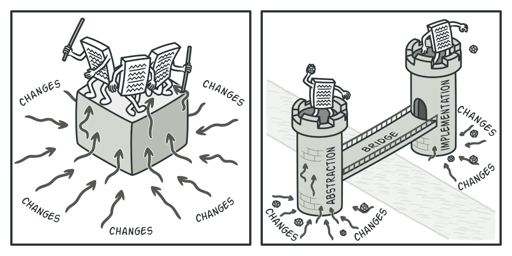
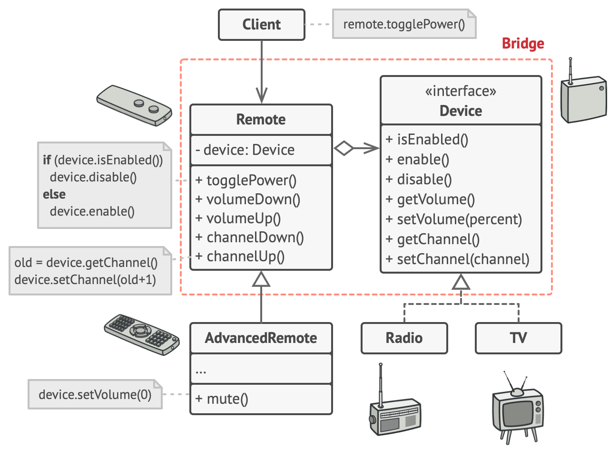

structural pattern



```cpp
class RedCircle: public Circle {};
class BlueCircle: public Circle {};
class GreenCircle: public Circle {};
...
```

---

**Delegate**: (n. 代表 / v. 委派)

def: An object hands off responsibility for particular behavior or task to another object.

1. **Simplify complex classes** by breaking down responsibilities.
2. **Reuse functionality** by allowing different objects to share behaviors.
3. **Encapsulate behavior** by abstracting operations into smaller, more manageable components.

---

## Solution



KeyPoint: Delegate color related work to color-object.

```cpp
class Circle {
private:
    ColorObject* color = new ColorObject("red");
};
...
```

---

## Abstraction and Implementation

### Abstraction (interface)

- is not supposed to do any real work on its own.
- it should delegate the work to the implementation layer.

e.g., GUI (graphical user interface)

!! not abstract classes or interface classes in here

#### 這裡的關係:

- **abstraction**: GUIs
- **implementation**: sys code (API)

GUI 不必要有很多功能，把功能交給 system code



## Case Study

### Pseudocode



```cpp
class LLMParser {
  LLMParser(ParseStrategy* st): {
    _st = st;
  }
    ParseStrategy* _st;
    Parse() {
        _st.parse();
    }

};

class InvoiceProcessor {
private:
    string ocr_invoice(){};
    Image image_preprocess(){};
    string parse_llm(){};
public:
    string recognize(invoice: input){};
};
// look nice if this InvoiceProcessor work along.
```

### Scenario

- Finance's Invoice (廠商的發票)
- LO's Invoice (我們的發票 報關單)

### Strategy

- abstract factory pattern
- Bridge pattern

```cpp
class InvoiceProcessor {
virtual void recognize(){} = 0;
};

// delegate data extract to extractor
class DataExtractor {
    OCRProcessor* invoice_ocr_processor;
    ImageProcessor* invoice_img_processor;
}

// Final result
class FinanceInvoiceProcessor: public InvoiceProcessor{
private:
    DataExtractor* data_extractor = new DataExtractor();
    LLMParser* llm_parser = new LLMParser(FINANCE_PROMPT);
public:
    void recognize(){};
}

class LOInvoiceProcessor: public InvoiceProcessor{
private:
    DataExtractor* data_extractor = new DataExtractor();
    LLMParser* llm_parser = new LLMParser(LO_PROMPT);
public:
    void recognize(){};
}
```

## Pros and Cons

### Pros

- You can create **platform-independent** classes and apps.
- The client code works with **high-level** abstractions. It isn't exposed to the platform details.
- **Open/Closed Principle**. You can introduce new abstractions and implementations independently from each other.
- **Single Responsibility Principle**. You can focus on high-level logic in the abstraction and on platform details in the implementation.

### Cons

- 程式碼變得很雜

## Relations with Other Patterns

### Adapter

- 讓兩個 independent 的 class 能夠 work
- Bridge: 被 delegate 的 class 是原本的 class 的重要功能 (implementation)

### Abstract Factory

- can use along
- can use along with Bridge
