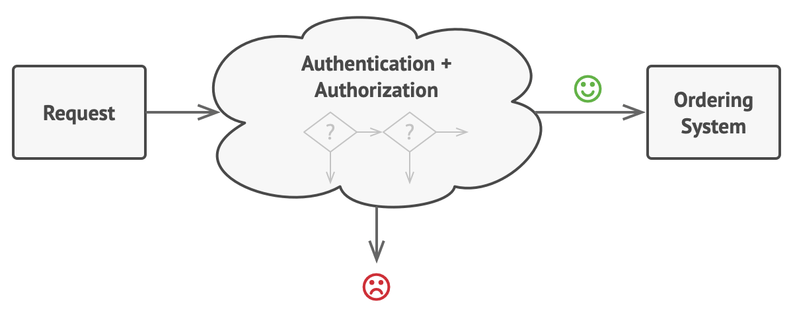
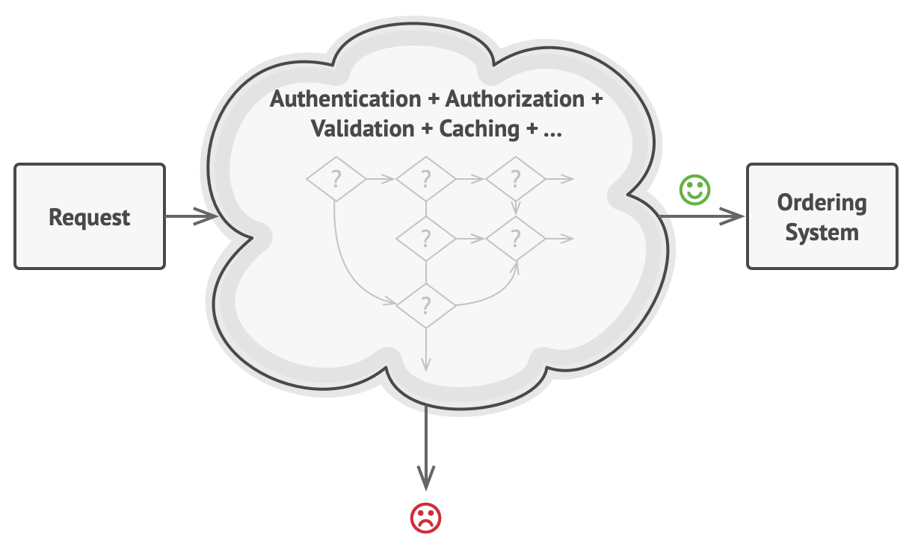
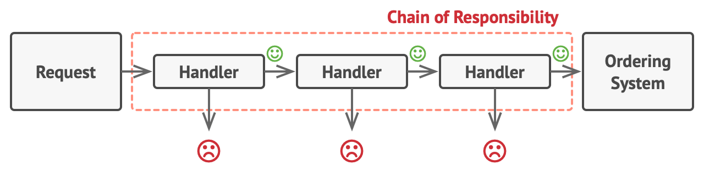
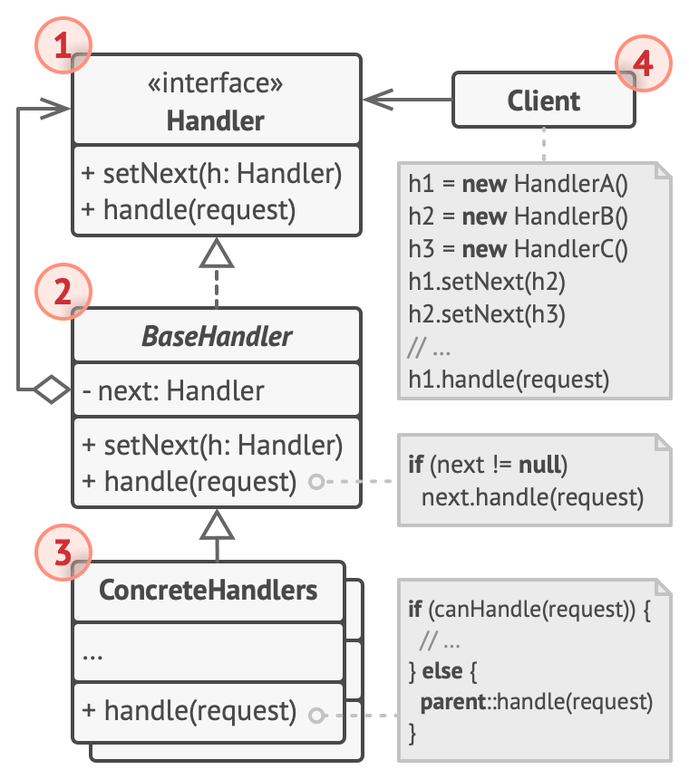

(behavioral pattern)

## Scenario



Request:
1. Authentication: only authenticated users can create orders.
2. Authorization: the user has authorization (admin) can full access.



3. need to sanitize the unsafe data
4. need to filters repeated request from same IP
5. add checker cached response

Proceed step:
1. -> 2. -> 3. -> 4. -> 5.

but sometimes, we can skip the steps

## Solution



### Case

Chain of Responsibility（職責鍊）大概是我們最容易理解的設計模式，因為我們每天都想盡辦法在實現它。

例如：

老闆交代了一件工作給PM =>
PM判斷此事優先權極高，立即跟資深工程師說有插件，做吧! =>
資深工程師判斷此事不急且快下班了，說我有事，菜鳥做吧! =>
菜鳥工程師看了一下沒人可以往後丟了，摸摸鼻子做事去了 => 結束

開玩笑地，相信大家的團隊應該是這樣：

老闆交代了一件工作給PM =>
PM整理了一些資訊，再交給資深工程師 =>
資深工程師判斷此事極容易所以直接寫完程式碼並做單元測試 => 結束

也就是說在每個Chain上的接收者可以選擇直接丟給下一個適合的接收者，或是選擇做事再判斷適合的接收者後往後丟。
我們要練習的多國語系案例比較偏向不符合我的職責就往後丟的情況。
其實職責鍊的用法非常多，我們的範例算是相對簡單的用法。

## Structure



## Case Study

```python
from __future__ import annotations
from abc import ABC, abstractmethod
from typing import Any, Optional


class Handler(ABC):
    """
    The Handler interface declares a method for building the chain of handlers.
    It also declares a method for executing a request.
    """

    @abstractmethod
    def set_next(self, handler: Handler) -> Handler:
        pass

    @abstractmethod
    def handle(self, request) -> Optional[str]:
        pass


class AbstractHandler(Handler):
    """
    The default chaining behavior can be implemented inside a base handler
    class.
    """

    _next_handler: Handler = None

    def set_next(self, handler: Handler) -> Handler:
        self._next_handler = handler
        # Returning a handler from here will let us link handlers in a
        # convenient way like this:
        # monkey.set_next(squirrel).set_next(dog)
        return handler

    @abstractmethod
    def handle(self, request: Any) -> str:
        if self._next_handler:
            return self._next_handler.handle(request)

        return None


"""
All Concrete Handlers either handle a request or pass it to the next handler in
the chain.
"""


class MonkeyHandler(AbstractHandler):
    def handle(self, request: Any) -> str:
        if request == "Banana":
            return f"Monkey: I'll eat the {request}"
        else:
            return super().handle(request)


class SquirrelHandler(AbstractHandler):
    def handle(self, request: Any) -> str:
        if request == "Nut":
            return f"Squirrel: I'll eat the {request}"
        else:
            return super().handle(request)


class DogHandler(AbstractHandler):
    def handle(self, request: Any) -> str:
        if request == "MeatBall":
            return f"Dog: I'll eat the {request}"
        else:
            return super().handle(request)


def client_code(handler: Handler) -> None:
    """
    The client code is usually suited to work with a single handler. In most
    cases, it is not even aware that the handler is part of a chain.
    """

    for food in ["Nut", "Banana", "Cup of coffee"]:
        print(f"\nClient: Who wants a {food}?")
        result = handler.handle(food)
        if result:
            print(f"  {result}", end="")
        else:
            print(f"  {food} was left untouched.", end="")


if __name__ == "__main__":
    monkey = MonkeyHandler()
    squirrel = SquirrelHandler()
    dog = DogHandler()

    monkey.set_next(squirrel).set_next(dog)

    # The client should be able to send a request to any handler, not just the
    # first one in the chain.
    print("Chain: Monkey > Squirrel > Dog")
    client_code(monkey)
    print("\n")

    print("Subchain: Squirrel > Dog")
    client_code(squirrel)
```

## Pros & Cons

### Pros

- You can control the order of request handling.
- Single Responsibility Principle. You can decouple classes that invoke operations from classes that perform operations.
- Open/Closed Principle. You can introduce new handlers into the app without breaking the existing client code.

### Cons

- Some requests may end up unhandled.

## Reference

https://refactoring.guru/design-patterns/chain-of-responsibility/python/example
