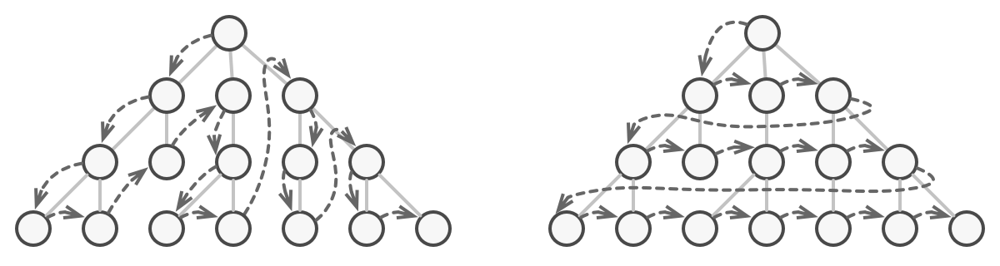
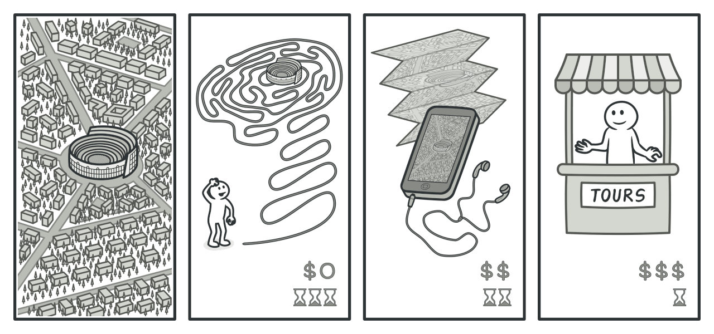
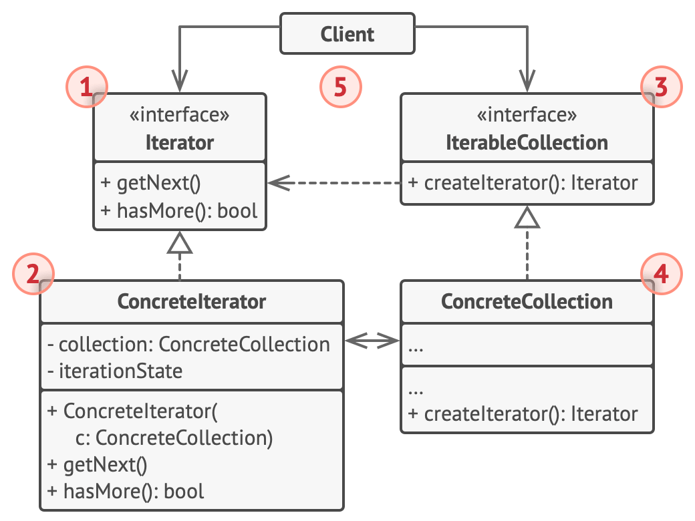

Iterator is a behavioral design pattern that lets you traverse elements of a collection without exposing its underlying representation (list, stack, tree, etc.).

## Scenario

Collections are one of the most used data types in programming. Nonetheless, a collection is just a container for a group of objects.

Adding more and more traversal algorithms to the collection gradually blurs its primary responsibility, which is efficient data storage.

without iterator pattern:

A position:
- plan1: next is B
- plan2: next is C

with iterator pattern:
- plan1: A->B->C->...
- plan2: A->C->...

## Structure

## Case Study

https://refactoring.guru/design-patterns/iterator/cpp/example
