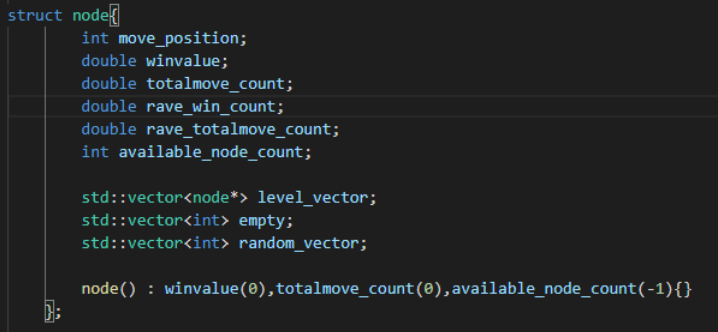
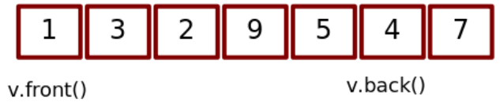
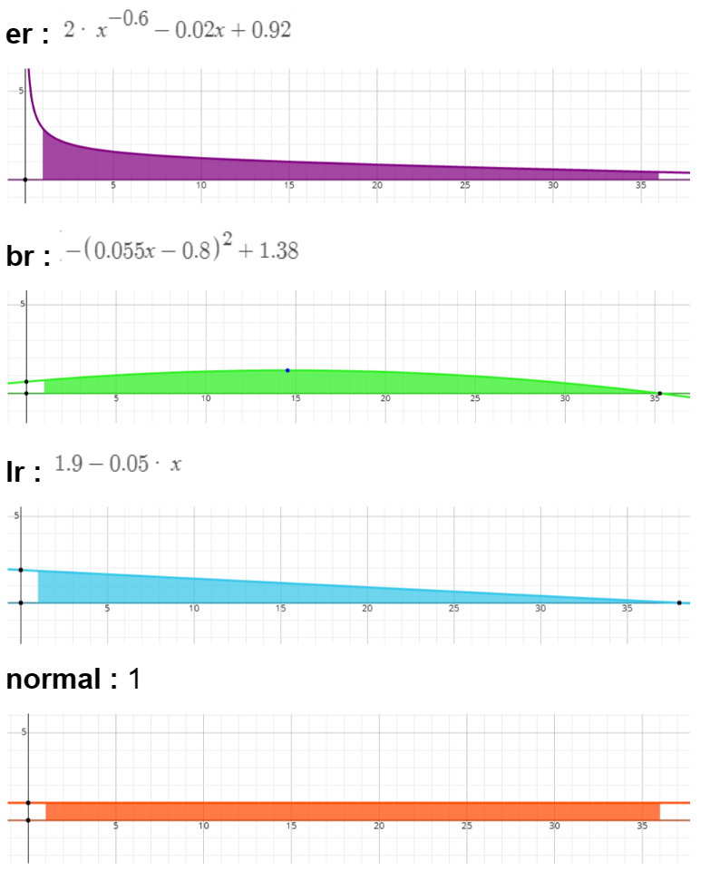
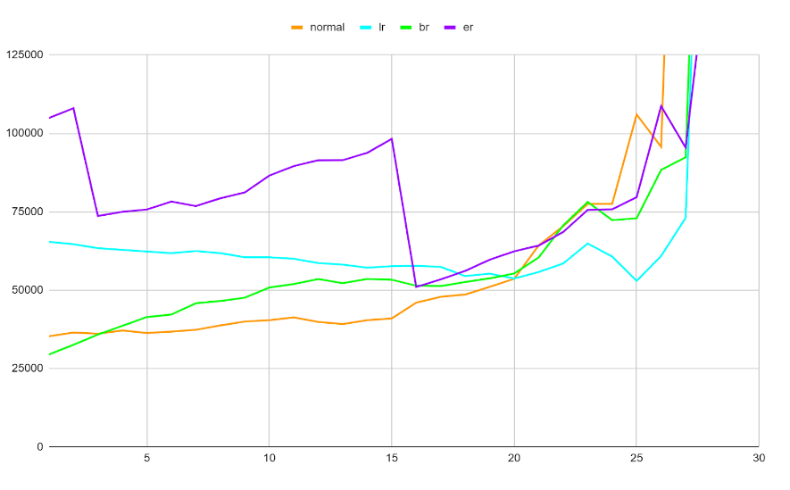
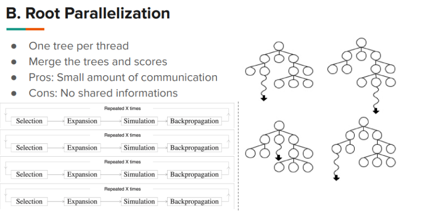
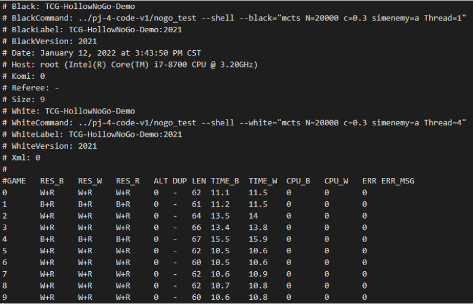

## Overview

This project applies **Monte Carlo Tree Search (MCTS)** to Hollow NoGo, a two-player strategy game in which captures and suicidal moves are forbidden. A player loses when no legal move remains.

The work focused on a practical question: within a fixed move-time budget, how can the agent spend more of its time exploring useful game states? I implemented the agent in C++ and experimented with simulation efficiency, opponent behavior, time allocation, parallel search, and Rapid Action Value Estimation (RAVE).

- [View the C++ implementation on GitHub](https://github.com/Aquila-f/Noge_zero)

## Search design

The agent follows the standard MCTS cycle:

1. **Selection** traverses the current tree using UCT to balance exploration and exploitation.
2. **Expansion** adds an unvisited legal move.
3. **Simulation** plays from the selected state to a terminal state.
4. **Backpropagation** updates visit and win statistics along the selected path.

The tree node stores direct and RAVE statistics, the move represented by the node, available child moves, empty positions, and a randomized exploration order.

## Improving simulation throughput

Rollouts dominate the search cost, so repeated work inside a simulation directly limits search depth. Instead of reshuffling the legal-move sequence for every choice, the implementation shuffles it once per simulation and consumes moves from that ordering.

This keeps the rollout policy stochastic while reducing repeated setup work.

## Opponent policies

Because alternating tree levels belong to different players, I compared three ways to model the opponent during simulation:

- **Normal** follows the same evaluation direction as the current player.
- **Inverse** reverses the evaluation direction for the opponent.
- **Random** selects a legal move without an evaluation preference.

With 5,000 simulations per move, the recorded head-to-head results were:

| Policy | vs. Normal | vs. Inverse | vs. Random |
| --- | ---: | ---: | ---: |
| Normal | — | 32.4% | 33.2% |
| Inverse | 67.6% | — | 55.3% |
| Random | 66.8% | 44.7% | — |

The comparison showed that opponent modeling materially changes the search result; treating both sides identically was not the strongest configuration in these experiments.

## Allocating time across the game

An equal time budget per turn does not reflect how the branching factor changes during a game. I evaluated four schedules: a constant budget, a linearly decreasing budget, a curved schedule that peaks near the middle game, and an early-heavy schedule.

The experiment favored the linearly decreasing and early-heavy schedules over a constant allocation, suggesting that spending more search time while the move space is still large can be useful for Hollow NoGo.

## Root parallelization

To increase the number of rollouts available within the same wall-clock budget, I implemented root parallelization with POSIX threads. Each thread builds an independent search tree; the agent then merges their root statistics before choosing a move.

This design avoids synchronization inside the search loop. The tradeoff is that workers cannot share information while searching, but contention remains low and the implementation stays comparatively simple.

## RAVE statistics

The node structure also tracks RAVE wins and visits. RAVE reuses information from moves that occur later in a rollout, allowing the agent to form an earlier estimate when direct visit counts are still sparse. These statistics complement the standard per-child win and visit totals rather than replacing them.

## What I learned

This project made the resource tradeoffs in search algorithms concrete. MCTS quality depends not only on the selection formula, but also on rollout cost, opponent assumptions, time management, and how parallel work is combined. Small decisions in those areas determine how much useful evidence the agent can collect before it must act.
