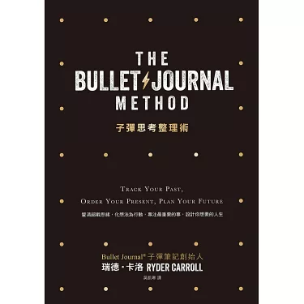
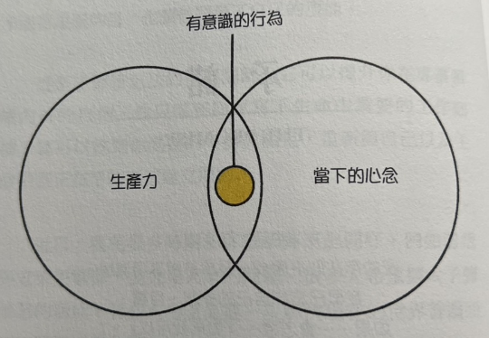
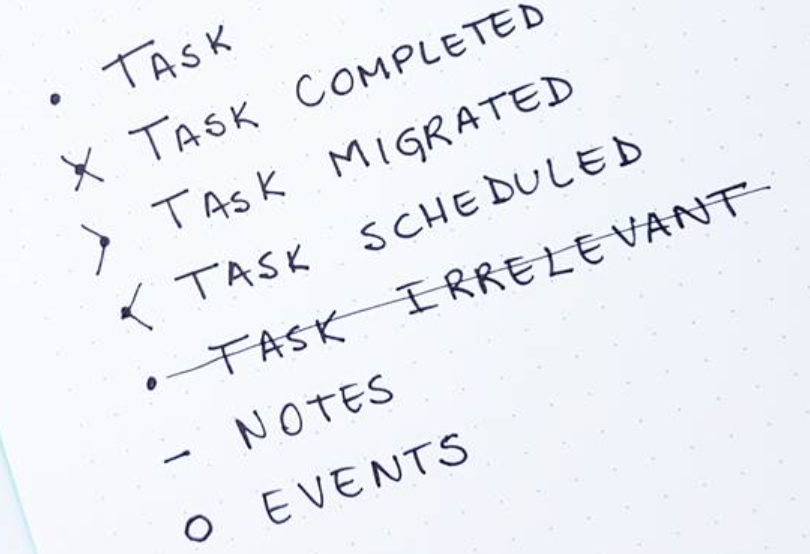
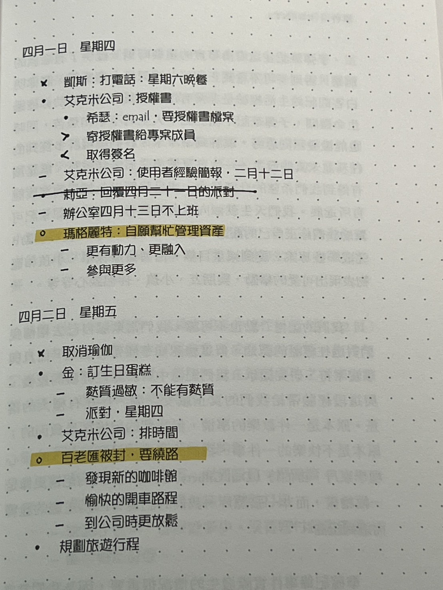
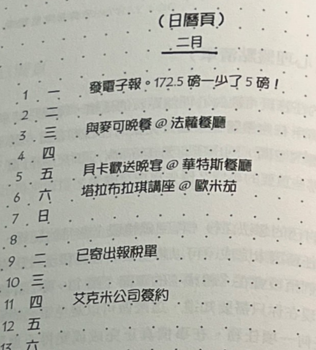
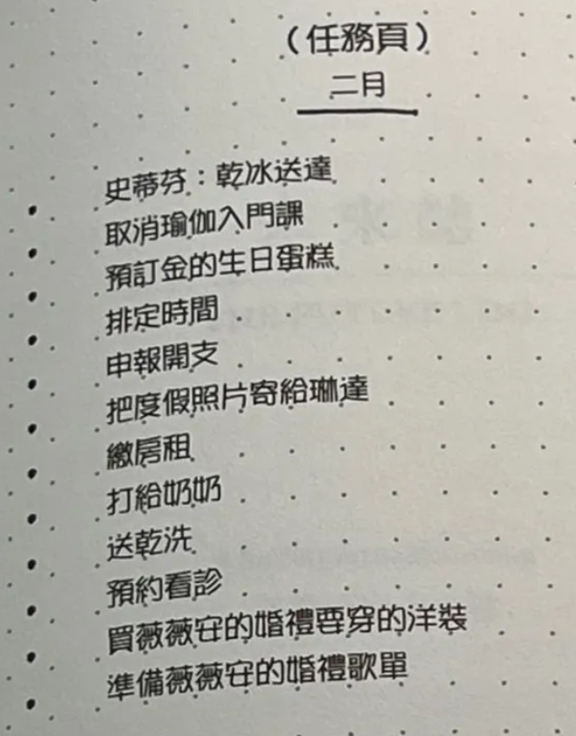
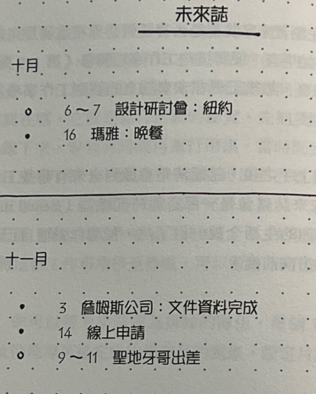
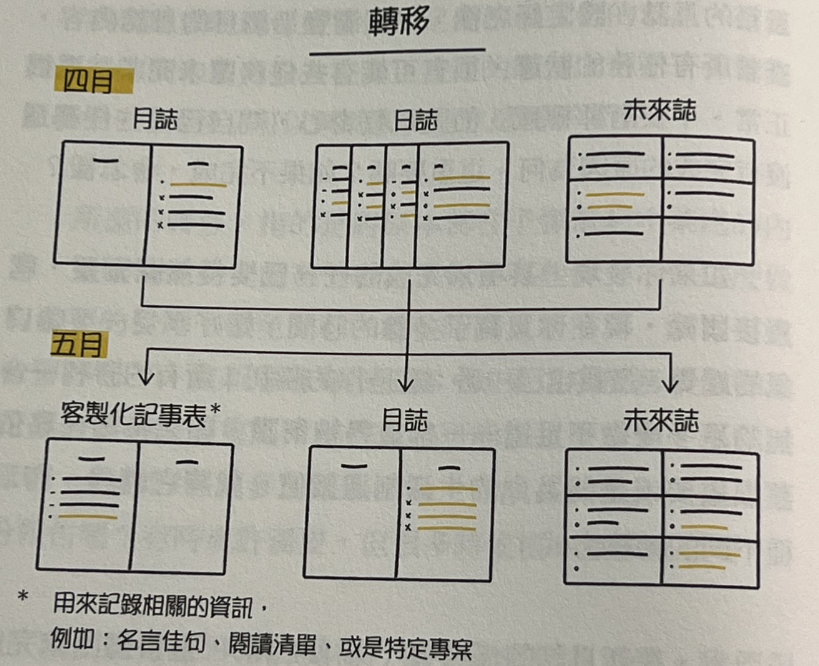

> Track your past, order your present, plan your future.

子彈筆記不只是一套記事格式。它試著把生產力、正念與有意識的行動放在同一個系統中，讓人定期確認自己正在做什麼，以及這些事情是否仍然重要。

## 這本書想解決什麼？

- 把模糊的念頭整理成能夠採取的行動。
- 將目標拆成較小、可以追蹤的步驟。
- 從日常紀錄中看見自己的時間與注意力流向。
- 定期刪除不再重要的任務，而不是無限累積待辦事項。

很多生活會逐漸變成自動駕駛：起床、工作、吃飯、遊戲、滑手機、睡覺，隔天重新開始。子彈筆記提供一個刻意停下來整理的節點。

## 核心方法

這套系統可以拆成三個動作：

1. **Rapid Logging**：快速記錄。
2. **Collection**：把相關內容組織在一起。
3. **Migration**：定期重新判斷什麼值得繼續。

### Rapid Logging

Rapid Logging 強調簡短、精確。每一筆內容依性質記為任務、事件或筆記，並使用不同符號表示狀態。

除了內容本身，每一頁也保留主題與頁碼，讓之後能透過 Index 找回來。

### Collections

Collection 是一組彼此相關的紀錄。常見形式包括：

- **Index**：所有主題與頁碼的總索引。
- **Daily Log**：當日任務、事件與筆記。
- **Monthly Log**：當月規劃與回顧。
- **Future Log**：尚未進入近期排程的長期事項。
- **Custom Collection**：依需求建立的閱讀、習慣或專案紀錄。

### Migration

Migration 不是把所有未完成任務機械式地搬到下一頁，而是重新審視它們。

- Daily Migration：決定未完成任務是否需要移到隔天。
- Monthly Migration：在月份交替時重新整理尚未完成的目標。
- 若一項任務已不再重要，就直接刪除。

真正有價值的不是保留每一件事，而是透過重複遷移產生一點阻力，迫使自己回答：「這件事現在仍值得我的時間嗎？」
