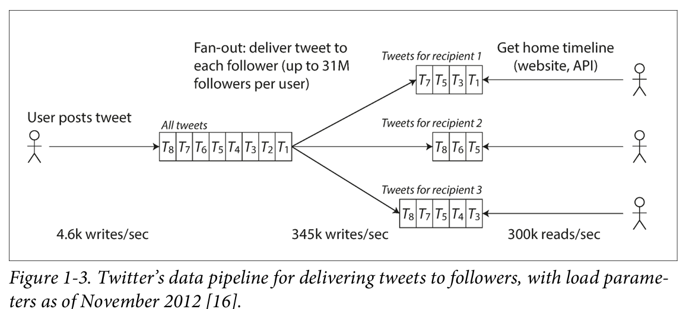
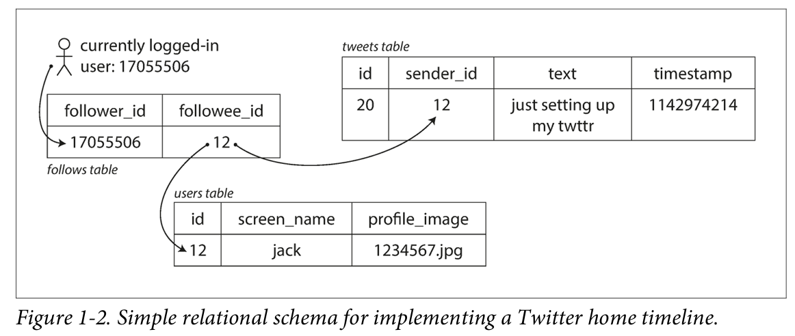

Common module:

1. databases
2. caches
3. search indexes (query)
4. stream processing
5. batch processing

Three concerns that are important in most sofeware systems:

1. Reliability 可靠性
    1. The system should continue to work correctly even in the face of ***adversity*** (硬體/軟體/人為錯誤)
2. Scalability 擴展性
    1. As the system grows, there should be reasonable ways of dealing with that.
3. Maintainability 維護性
    1. Over time, many different people  will work on the system. e.g., 開發 / 維運 … 系統應該要所有人再其上工作時都保有*生產力*.

## 可靠性

即使發生某些問題，系統仍然可以繼續正常運作

faults 故障 ≠ failure 失效

故障 faults 是某部分的錯誤，失效 failure 是整個 system 無法運作

能夠容忍故障的系統稱做 resilient system

- 硬體故障: 壞軌…
- 軟體錯誤:
- 人為失誤

`對使用者負責` !!

## 擴展性

即使今天能可靠的工作，無法確保明天也能可靠的工作? why?

e.g., 負載增加 / 資料爆炸

### Load 負載

- load parameters: 負載指標 e.g., (request per sec / database read write ratio / cache hit rate )
- Example:
    - Twitter : `post` and `home timeline`  (2012)
    - `post` 發布貼文 : 4.6k requests/sec, peak 12k requests/sec
    - `home timeline` 時間軸主頁 : 300k requests/sec
    
    問題點: *fan-out* (某個 request 進來，需要對其他服務發出更多 request)
    
    1. 當 `post` 發生就存到 tweets table, `home timeline` 發生就根據 user 的 followee ids 找到所有對應的貼文後依照時間排序

    

    1. 當 post 發生就推送到每個人的 timeline 上, 主頁打開時就得讀取快很多

    
    
- Result:
    - 2 > 1, `home timeline`  > `post`
    - 2的缺點: 名星有大量的 followers
    - combine 1 & 2

### Performance 性能

當負載增加，resource quota 不變，怎辦

常見的參數: through put / response time

- Pitfall: latency ≠ response time
- Evaluate Response time: don’t use average time use median (percentile) e.g., 50p, 95p, 99p
    - from Amazon response time 每增加 100ms, 銷售額 -1%

### Approaches for Coping with Load (對應負載壓力)

- vertical scaling 垂直擴展: 強化機器 (scaling up)
- horizontal scaling 水平擴展: 量化機器 (scaling out)
- for 新產品的 proirity: 快速跌帶 > 假想負載擴展

## 可維護性

軟體大部分的成本並不是落在最初的開發階段，而是在 maintain (e.g., fixing bugs, keeping its system operational, investigating failures, adapting it to new platforms, modifying it for new cases, repaying technical debt, add new features)

故 開發時應該要注意

- Operability 可維運性
- Simplicity 簡單性
- Evolvability 可演化性

### 可維運性 (making life easy for operations)

保持可穩定運行最重要的一環

- Monitoring mechanism
- Tracking down problems / failures
- Keeping software Updated (?)
- Deployment, configuration
- Documentation
- Preserving the organization’s knowledge about system even people come and go
- …

### 簡單性  (managing complexity)

小專案很容易就能寫出簡單又漂亮的程式碼，但隨著時間推進就會變成 big ball of mud

key to solve: 好的抽象化設計

### 可演化性 (making change easy)

很少有永遠不變的系統設計，永遠都有新case / 新 feature / update …

組織流程: Agile 

更安全的環境: TDD

容易讀: 軟工 相關的東東
