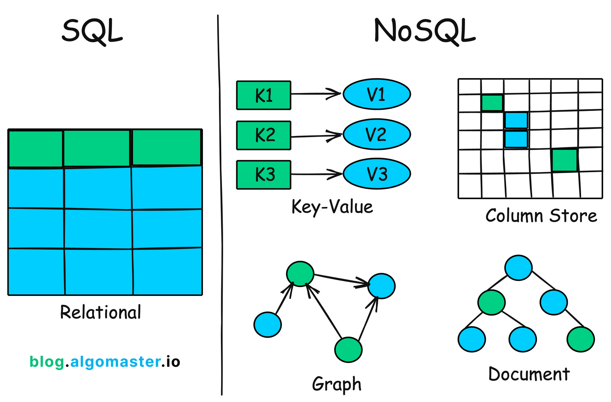
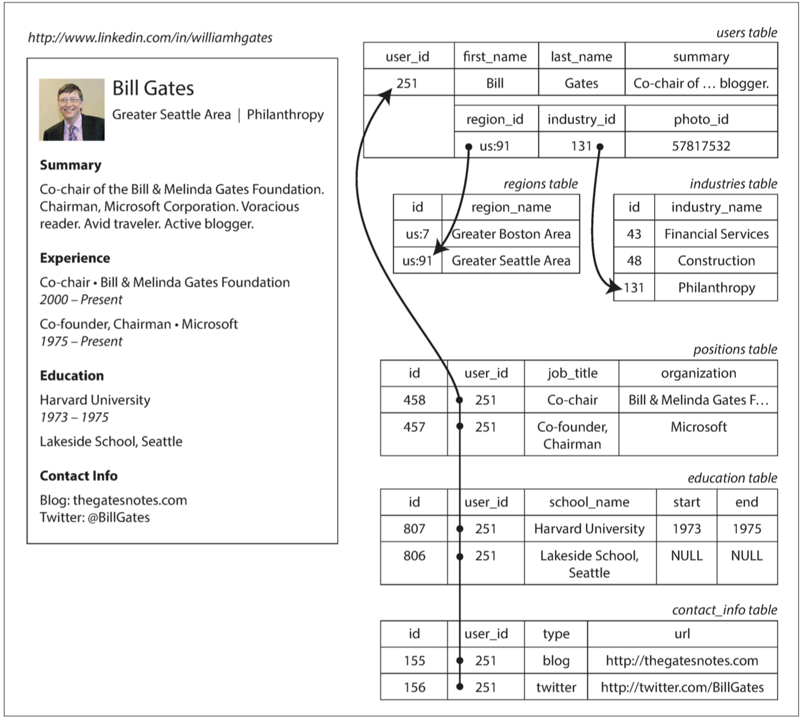
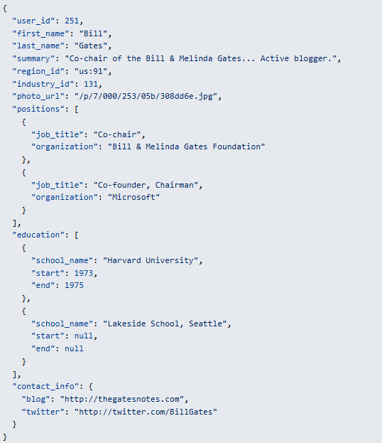
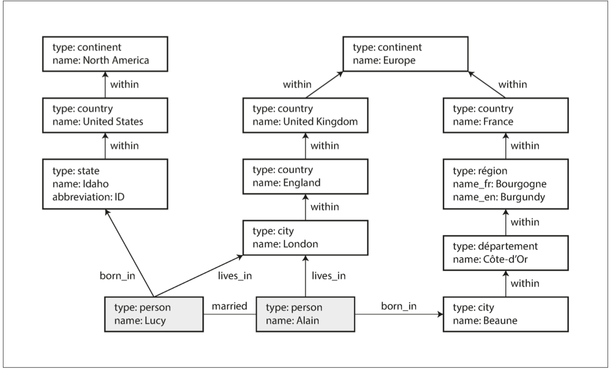

## Data models

資料是軟體開發中最重要的部分，他影響軟體編寫方式，與我們的思考方式

e.g., 沒有大家的貼文，我們滑 IG 有意義嗎?

### Relational Model Versus Document Model



現今大部分我們看到內容還是由 relational database 提供

- NoSQL: Not Only SQL
    - The adoption of NoSQL databases is driven by:
        - A need for greater scalability than RDBMS, including very large datasets or very high write throughput
        - ~~free and open source software~~
        - Specialized query operations that are not well supported by the relational model
            - Graph Traversal Queries / Hierarchical Data Queries / Text Search and Ranking …
            - Examples

                ### 1. **Graph Traversal Queries**

                - **Use Case**: Finding all friends of friends in a social network.
                - **Problem**: SQL struggles with recursive relationships or deep traversals.
                - **Better Fit**: Graph databases (e.g., Neo4j, ArangoDB) with languages like Cypher or Gremlin.

                ---

                ### 2. **Hierarchical Data Queries**

                - **Use Case**: Organizational charts, file system trees.
                - **Problem**: Representing and querying hierarchical data (like parent-child trees) requires complex recursive CTEs or adjacency list hacks in SQL.
                - **Better Fit**: Document databases (e.g., MongoDB), or graph databases.

                ---

                ### 3. **Text Search and Ranking**

                - **Use Case**: Full-text search with relevance scoring, stemming, synonyms.
                - **Problem**: SQL is limited in natural language relevance scoring and inverted index operations.
                - **Better Fit**: Search engines like Elasticsearch or Apache Solr.
        - Frustration with the restrictiveness of relational schemas, desire for a more dynamic and expressive data model

### **物件關聯的不匹配 (The Object-Relational Mismatch)** (relational model 的弱點)





- JSON 模型，減少了 program 與 storage 之間的不匹配 → JSON 有更好的 (locality)
    - Relational: 查多個表
    - JSON: 一個查詢就夠了

### Many-to-One and Many-to-Many Relationships (document model 的弱點)

- What is normalization?
    - 當一個 data 出現在很多地方，我們可用一個 ID 代表他們，並且對 ID 進行定義 (有點類似抽出重複的扣?)
- 多對一
    - **解釋**：多篇文章（Article）「多」→ 對應到同一個作者（Author）「一」
- 多對多 (需要 join table)
    - Amy 選了 Math 和 Physics
    - Ben 選了 Math

    一位學生可選多門課；一門課也可有多位學生。


### Document Databases 重演歷史?

多對一 & 一對多，好像都沒辦法很好的支持

- Hierarchical model (tree)
- Network model (node can have multiple parents)
- Relational model (SQL)

Document Database → 有點像是 Hierarchical model，但 document model 有一對多 & 多對多的能力

- document model 多對多 一對多 table


    | 關係類型 | 表達方式 | 適合情境 |
    | --- | --- | --- |
    | 一對多 | 嵌入子文件 | 關聯緊密、資料量小 |
    | 一對多 | 使用 `_id` 參照 | 關聯鬆散、資料獨立性高 |
    | 多對多 | 互相記 ID 陣列 | 資料不大、查詢頻繁 |
    | 多對多 | 使用中介集合 | 資料量大、結構複雜、彈性佳 |

### Relational database vs Document database (conclusion)

- **簡化與其 co-op 的應用程式代碼? it depends**
    - 如果應用很多 展示整個 document 的頁面，e.g., NAS 非常適合
        - 組成一個 document 只需要 1 次 read
        - relational database 需要多次
    - 有多對多的應用情境，e.g., 需要知道課被誰選，誰選了什麼課 那 document database 就沒那麼適合
- **靈活性**
    - Document model 是 schemaless (?), schema on read (o)
    - Relational model: schema on write
    - 導致問題? Relational model 變更 schema 速度緩慢 (有改進方法)
    - Scenario:
        - collection 中的 items 不都具有相同結構. e.g., Synology NAS spec
        - or 資料結構由外部決定
- **局部性**
    - 儲存局部性優勢 (document model)
    - 注意: 僅限小修改有利 (更改後不影響整個 document 的大小, e.g., float → float) dict (?)
- **相似的地方**
    - 雙方都在進步
    - relational model → locality 優化
    - document model → 多對多能力

## 資料查詢語言

與資料庫互動的方法 查詢

1. 命令式 (imperative)
    1. manually operation. e.g., 寫個 for loop 拿出裡面特定的 objects

    ```jsx
    function getSharks() {
        var sharks = [];
        for (var i = 0; i < animals.length; i++) {
            if (animals[i].family === "Sharks") {
                sharks.push(animals[i]);
            }
        }
        return sharks;
    }
    ```

2. 宣告式 (declarative)
    1. don't need to know the implementations

    ```jsx
    SELECT * FROM animals WHERE family ='Sharks';
    ```

    有種抽象抽的很好的概念，底下可以平行優化 (感覺適合 GPU 當作搜尋引擎)

3. MapReduce

    介於 命令式與宣告式 之間的一種查詢模式 (感謝 Google )，提供能處理更複雜的搜尋

    - 可支援跨多台機器處理大量資料，甚至部分 NoSQL 也有支援部分功能 e.g., MongoDB

    **MapReduce → Map & Reduce**

    - map (collect): 有點類似 declarative 處理大量資料 (?)
    - reduce (fold / inject): 再用 imperative 處理細節 (?)

    ```jsx
    db.observations.mapReduce(function map() {
            var year = this.observationTimestamp.getFullYear();
            var month = this.observationTimestamp.getMonth() + 1;
            emit(year + "-" + month, this.numAnimals);
        },
        function reduce(key, values) {
            return Array.sum(values);
        },
        {
            query: {
              family: "Sharks"
            },
            out: "monthlySharkReport"
        });
    ```

## Graph data model

更適合用在大量的多對多資料，用 Graph 處理資料會更自然 e.g., 社交網絡 / 推薦系統 / 知識圖譜



### **Graph 的組成**

Vertices: 代表實體

Edges: 代表實體間的關係

Properties: 可加在節點或邊上，儲存詳細資料

### Cypher (Graph 的查詢與法)

查詢所有從美國移民到歐洲的人

```jsx
MATCH
  (person) -[:BORN_IN]->  () -[:WITHIN*0..]-> (us:Location {name:'United States'}),
  (person) -[:LIVES_IN]-> () -[:WITHIN*0..]-> (eu:Location {name:'Europe'})
RETURN person.name
```
