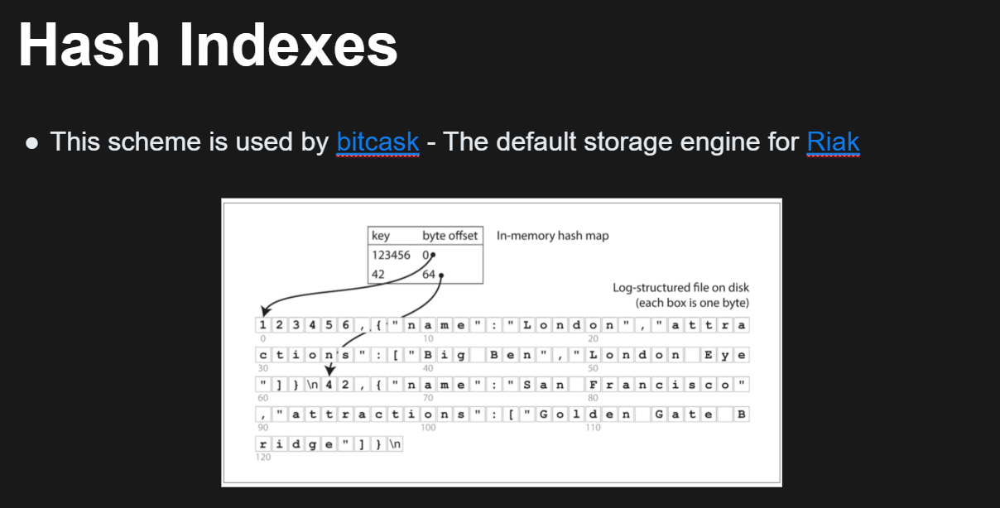
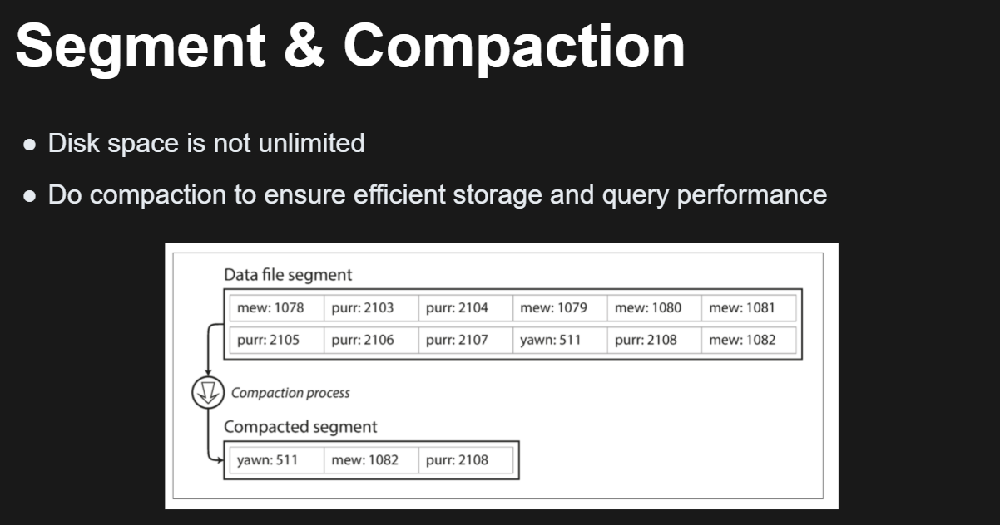
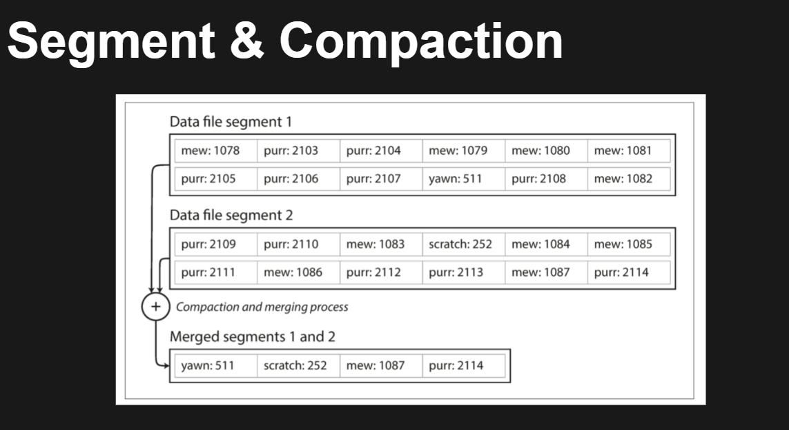
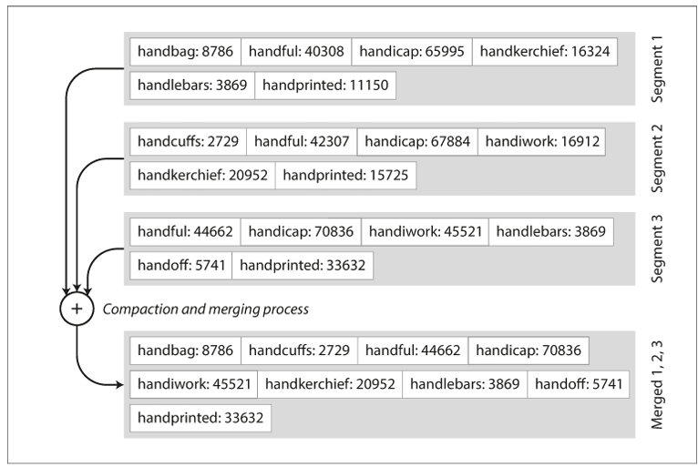
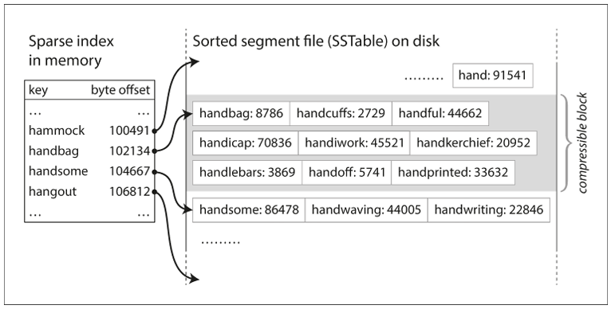
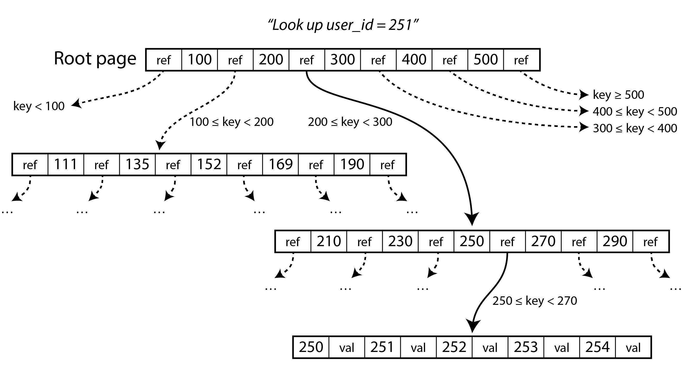
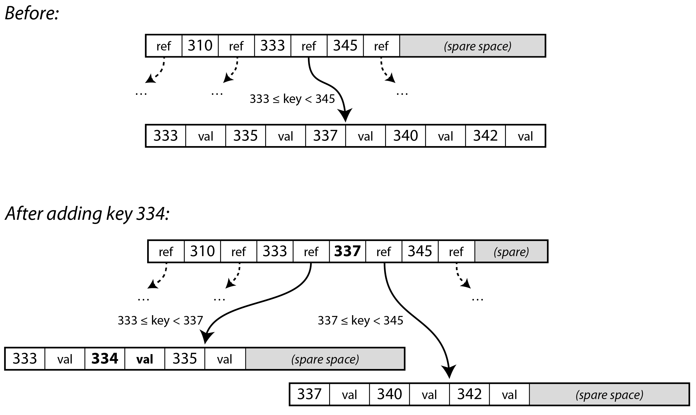
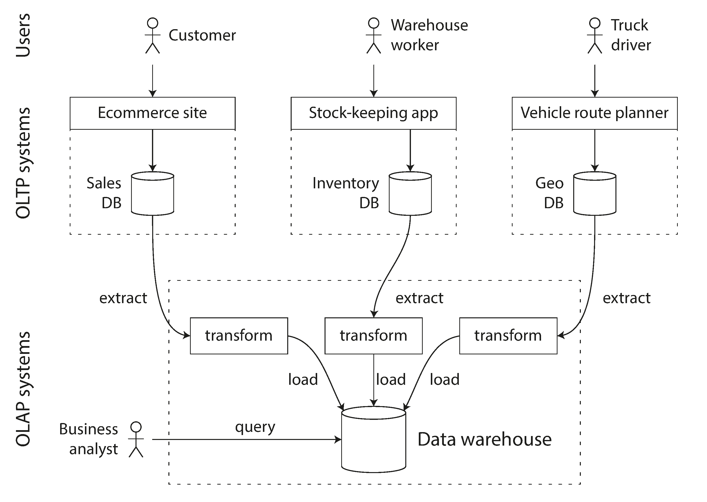

> 認識資料庫內部是如何儲存跟檢索的 (why?)

相對底層的東西，更認識資料庫。有點類似我們為何要學 OS?

- **有點類似我們為何要學 OS?**
    - 你平常用電腦很順，但遇到效能瓶頸、記憶體爆掉、或多工效率低時，只有理解 OS 如何排程、管理記憶體、處理 I/O，才能調整設定、寫出更有效率的程式，甚至解釋出為什麼某些情境下會慢。
    - 例：調整 swap 設定、理解 thread/context switch 開銷、理解 cache hit/miss。

提升 know how ，在遇到問題 e.g., 資料庫瓶頸能知道該發生什麼事情與參數調整

## Data Structures That Power Your Database

認識兩大儲存引擎:

日誌結構 (log-structured) & 分頁導向 (page-oriented)

### log structured

顧名思義就是log

用兩隻 bash func 就可以變成資料庫了!?

```bash
db_set(){
	echo "$1,$2" >> database
}

db_get(){
	grep "^$1," database | sed -e "s/^$1,//" | tail -n 1
}
```

```
# database
123,{"name":"Jasper"}
456,{"name":"Jack"}
123,{"name":"Jerry"}
123,{"name":"Jeffery"}
456,{"name":"Julian"}
```

What's the problems?

- write O(1) / **read O(n)**
- save lot of useless data

**解決 read O(n) 問題:**



**解決存一堆拉基的問題:**





Two more Questions:

- Memory 不是無限大的，hash table 不可能存所有的 key offset pair
- Range Query issue, e.g., 查詢 key0001 ~ key9999 的資料 …

### SSTable (Sorted String Table)

**Advantage of SSTable**

- Merge segments is simple and efficient (in disk)



- no longer need to keep an index of all the keys in memory (解決了 mem 不足問題)
- 查詢也用 binary search 就好



SSTable 解決了 mem 不足問題 / 也解決了

**New Question:**

如何確保要寫入的 segment 是 sorted 的? 用 balanced tree (e.g., RB Tree / AVL Tree)

新的寫入發生時，會先寫入到 mem 中的 balanced tree (有時稱做 memtable)

現在 log structure 儲存引擎以如下方式工作：

- 有新寫入時，將其新增到記憶體中的平衡樹資料結構（例如紅黑樹）。這個記憶體樹有時被稱為 記憶體表（memtable）。
- 當 memtable 大於 threadhold，將其作為 SSTable 檔案寫入硬碟。這可以高效地完成，因為樹已經維護了按鍵排序的鍵值對。新的 SSTable 檔案將成為資料庫中最新的段。當該 SSTable 被寫入硬碟時，新的寫入可以在一個新的記憶體表例項上繼續進行。
- 收到讀取請求時，首先嘗試在記憶體表中找到對應的鍵，如果沒有就在最近的硬碟段中尋找，如果還沒有就在下一個較舊的段中繼續尋找，以此類推。
- 時不時地，在後臺執行一個合併和壓縮過程，以合併段檔案並將已覆蓋或已刪除的值丟棄掉。

Handle crash: use a really log. to store the most recent write.

Case study: LevelDB / RocksDB

The terms (SSTable / memtable) are intertuced by Google's bitTable paper

Naming: LSM-Tree (Log structure Merge tree)

- Optimizations
    - Bloom filters
    - Leveled compaction

## B Tree

The most widely used indexing structure.



一樣有類似的 sorted 架構方便查找，但…

- Different design philosophy:
    - B-Tree break the database down intoo fixed-size blocks. e.g., 4KB / pgSQL 8KB / MySQL 16KB
    - 這種設計跟底層非常像
- Page 中:
    - key / ref / value (only in leaf in B+ tree)



- 當 page is full (branch factor)

### 提升 B tree 可靠

問題：寫入是直接在 BTree 上執行, 若多個寫入執行中時  crash 發生的話 會污染整個樹，有幾個解決方法

- *透過 write-ahead log*，WAL 解決 (log 用於復原)
- copy on write，複製一份出來，寫入完再換 reference

## B-tree vs LSM-tree

- 經驗來說…
    - LSM-tree 更適合 寫入密集型應用
    - B-tree 對讀取更快
    - moreover 有時候也能再 LSM tree 中看到 B tree 的身影
- 弱點:
    - LSM-tree:
        - write amplification (多做很多 operation)
    - B-tree:
        - fragmentation issue (太多瑣碎的的 pages)

## other db engineer

- mem db
    - VoltDB / SingleStore / Oracle TimesTen / RAMCloud
- full context …

### *OLTP (online transaction processing)*

- GB ~ TB
- read & write

---

## OLAP (Online analytical processing)

- TB ~ PB
- calculation during access
- Warehouse



通常有 ETL (extract / transform / load)

## Conclusion

- OLTP
    - B-tree
    - LSM-tree
- OLAP
    - Warehouse

to be continue…
