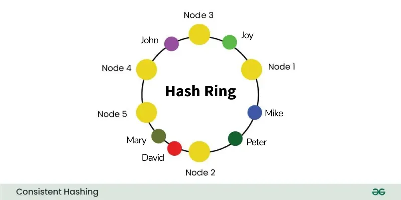
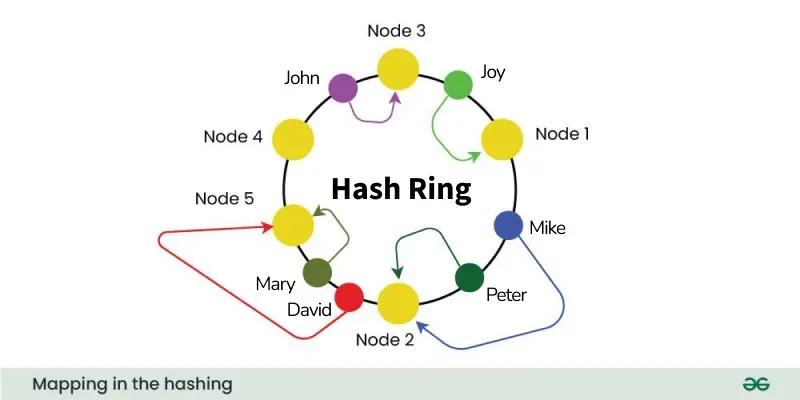
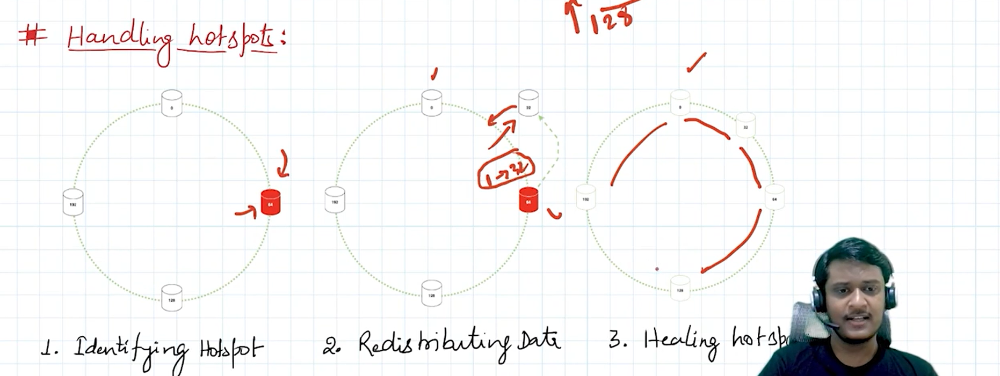

ref: [https://www.geeksforgeeks.org/system-design/consistent-hashing/](https://www.geeksforgeeks.org/system-design/consistent-hashing/)

**Consistent Hashing - System Design**

## Usage scenario:

load balance such as nodes / partition

request 要給到哪個 node

data 要存到哪個 partition



- It represents the requests by the clients and the server nodes in a virtual ring structure which is known as a **hashring**.
- The number of locations in this ring is not fixed, but it is considered to have an infinite number of points
- The server nodes can be placed at random locations on this ring which can be done using hashing.
- The requests are also placed on the same ring using the same hash function.

## **How to decide which request will be served by which server?**

clockwise



```cpp
#include <bits/stdc++.h>

using namespace std;

class ConsistentHashRing {
private:
    map<int, string> ring;
    set<int> sorted_keys;
    int replicas;

    int get_hash(const string& value) {
        hash<string> hash_function;
        return hash_function(value);
    }

public:
    ConsistentHashRing(int replicas = 3) : replicas(replicas) {}

      // Function to add Node in the ring
    void add_node(const string& node) {
        for (int i = 0; i < replicas; ++i) {
            int replica_key = get_hash(node + "_" + to_string(i));
            ring[replica_key] = node;
            sorted_keys.insert(replica_key);
        }
    }

      // Function to remove Node from the ring
    void remove_node(const string& node) {
        for (int i = 0; i < replicas; ++i) {
            int replica_key = get_hash(node + "_" + to_string(i));
            ring.erase(replica_key);
            sorted_keys.erase(replica_key);
        }
    }

    string get_node(const string& key) {
        if (ring.empty()) {
            return "";
        }

        int hash_value = get_hash(key);
        auto it = sorted_keys.lower_bound(hash_value);

        if (it == sorted_keys.end()) {
            // Wrap around to the beginning of the ring
            it = sorted_keys.begin();
        }

        return ring[*it];
    }
};

int main() {
    ConsistentHashRing hash_ring;

    // Add nodes to the ring
    hash_ring.add_node("Node_A");
    hash_ring.add_node("Node_B");
    hash_ring.add_node("Node_C");

    // Get the node for a key
    string key = "first_key";
    string node = hash_ring.get_node(key);

    cout << "The key '" << key << "' is mapped to node: " << node << endl;

    return 0;
}
```

## Handling hotspot



虛擬節點

https://github.com/Admol/SystemDesign/blob/main/CHAPTER%2005%EF%BC%9ADESIGN%20CONSISTENT%20HASHING.md

**Question: 不能用排隊機制嗎？為何要需要 consistent hashing ?**

e.g., node1, node2, node3, new request 近來就 assign 給目前最少 request 的 node

priority_queue<{handle user, node}> // min heap

也能解決 hot spot, insert 一個新的 node 即可
