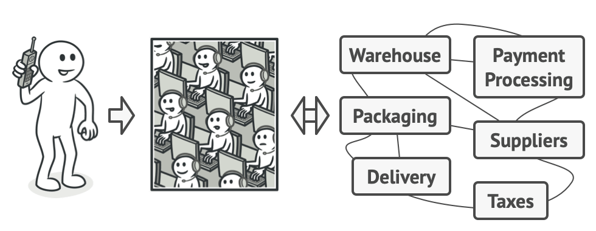
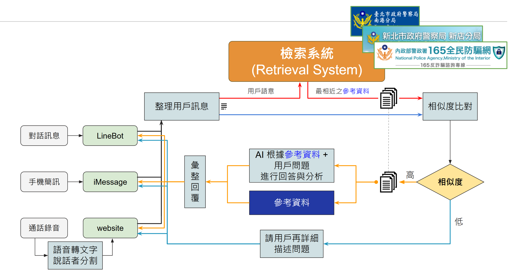

Facade is a structural design pattern that provides a simplified **interface** to a library, a framework, or any other complex set of classes.

最少知識原則: 只與最接近的朋友交談。



## Introduction

A facade is a class that provides a simple interface to a complex subsystem which contains lots of moving parts. **A facade might provide limited functionality** in comparison to working with the subsystem directly. However, it includes only those features that clients really care about.

Having a facade is handy when you need to integrate your app with a sophisticated library that has dozens of features, but you just need a tiny bit of its functionality.

## Scenario

- 法詐騙底層系統的 api 流程

```
user query + [signature] -> embedding vector -> retrieved data ...
                         -> embedding vector -> retrieved data ...
```

* signature: 不同平台上的認證 e.g., line / iMessage
- 非常複雜，但 user 不需要知道這些，所以提供一個 interface 才是正解



## Case Study

https://refactoring.guru/design-patterns/facade/cpp/example

## Recall Related Design Pattern

- **Facade** defines a new interface for existing objects, whereas **Adapter** tries to make the existing interface usable. **Adapter** usually wraps just one object, while Facade works with an entire subsystem of objects.
- **Abstract Factory** can serve as an alternative to **Facade** when you only want to hide the way the subsystem objects are created from the client code.

## Reference

https://refactoring.guru/design-patterns/facade
