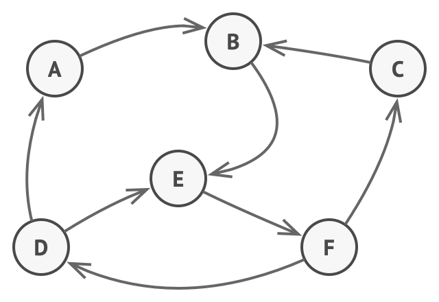
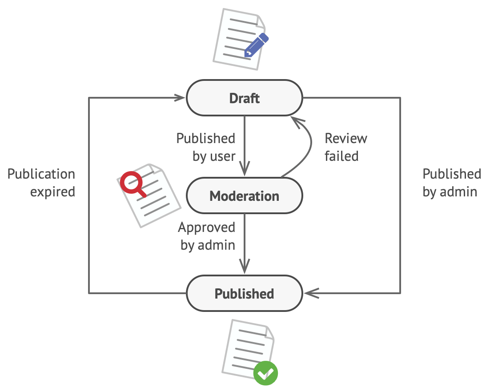
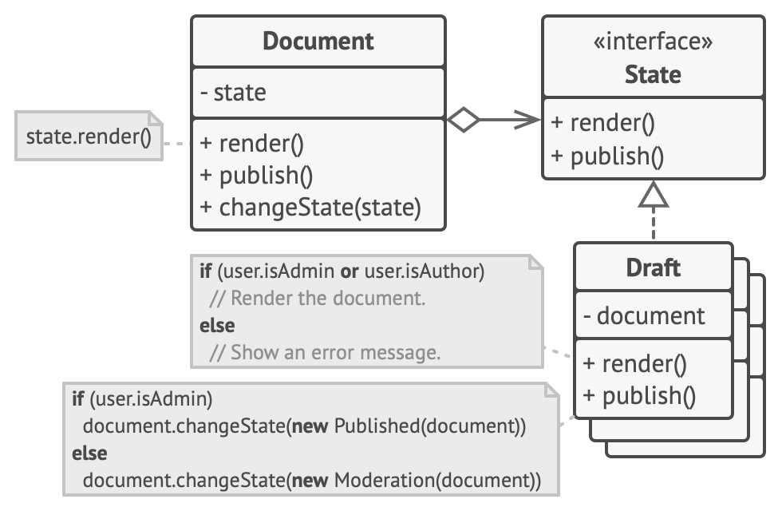

The State pattern is closely related to the concept of a **Finite-State Machine**





Imagine that we have a `Document class`. A document can be in one of three states: `Draft`, `Moderation` and `Published`. The publish method of the document works a little bit differently in each state:

- In `Draft`, it moves the document to moderation.
- In `Moderation`, it makes the document public, but only if the current user is an administrator.
- In `Published`, it doesn't do anything at all.

## Scenario

`State machines` are usually implemented with lots of **conditional** statements (if or switch) that select the appropriate behavior depending on the current state of the object.

```java
class Document is
    field state: string
    // ...
    method publish() is
        switch (state)
            "draft":
                if (currentUser.role == "admin")
                    state = "published"
                if (currentUser.role == "author")
                    state = "moderation"
                break
            "moderation":
                if (currentUser.role == "admin")
                    state = "published"
                break
            "published":
                if (time.expire)
                    state = "draft"
                break
    // ...
```

- weakness:
    - adding more and more states and state-dependent behaviors to the Document class.
    - Code like this is very difficult to maintain because any change to the transition logic may require changing state conditionals in every method.

## Solution

The **State pattern** suggests that you create new classes for all possible states of an object and extract all state-specific behaviors into these classes.



## Case Study

### State

```cpp
class State {
public:
    virtual void render(Document& document) = 0;
    virtual void publish(Document& document) = 0;
};
```

### Document

```cpp
class Document {
private:
    std::shared_ptr<State> state;

public:
    Document(std::shared_ptr<State> initialState) : state(initialState) {}

    void render() {
        state->render(*this);
    }

    void publish() {
        state->publish(*this);
    }

    void changeState(std::shared_ptr<State> newState) {
        state = newState;
    }
};
```

### Draft

```cpp
class Draft : public State {
public:
    void render(Document& document) override {
        // Draft render logic
        std::cout << "Rendering draft document...\n";
    }

    void publish(Document& document) override {
        // Change state based on user role
        if (document.isAdmin()) {
            document.changeState(std::make_shared<Published>());
            std::cout << "Document published from draft.\n";
        } else {
            document.changeState(std::make_shared<Moderation>());
            std::cout << "Document sent to moderation.\n";
        }
    }
};
```

### Moderation

```cpp
class Moderation : public State {
public:
    void render(Document& document) override {
        // Moderation render logic
        std::cout << "Rendering document in moderation...\n";
    }

    void publish(Document& document) override {
        // Moderation publish logic
        std::cout << "Moderation state cannot publish directly.\n";
    }
};
```

### Published

```cpp
class Published : public State {
public:
    void render(Document& document) override {
        // Published render logic
        std::cout << "Rendering published document...\n";
    }

    void publish(Document& document) override {
        std::cout << "Document is already published.\n";
    }
};
```

## Pros and Cons

### Pros

- Single Responsibility Principle.
- Open/Closed Principle.
- Simplify the code of the context by eliminating bulky state machine conditionals.

### Cons

- Applying the pattern can be overkill if a state machine has only a few states or rarely changes.

## Relations with Other Patterns

- `Bridge`, `State`, `Strategy` (and to some degree Adapter) have very similar structures. Indeed, all of these patterns are based on composition, which is delegating work to other objects. However, they all solve different problems. A pattern isn't just a recipe for structuring your code in a specific way. It can also communicate to other developers the problem the pattern solves.

- State can be considered as an extension of `Strategy`. Both patterns are based on composition: they change the behavior of the context by delegating some work to helper objects. `Strategy` makes these objects completely independent and unaware of each other. However, State doesn't restrict dependencies between concrete states, letting them alter the state of the context at will.
